Mini Data-Analysis Deliverable 1
================

## Data Installation

1.  Install the [`datateachr`](https://github.com/UBC-MDS/datateachr)
    package by typing the following into your **R terminal**:

<!-- -->

    install.packages("devtools")
    devtools::install_github("UBC-MDS/datateachr")

2.  Load the packages below.

``` r
library(datateachr) # --> for loading dataset for this work
library(tidyverse) # --> for data wrangling and analysis
```

    ## ── Attaching packages ─────────────────────────────────────── tidyverse 1.3.2 ──✔ ggplot2 3.3.5     ✔ purrr   0.3.4
    ## ✔ tibble  3.1.8     ✔ dplyr   1.0.7
    ## ✔ tidyr   1.2.1     ✔ stringr 1.4.0
    ## ✔ readr   2.1.2     ✔ forcats 0.5.1

    ## Warning: package 'readr' was built under R version 4.0.5

    ## ── Conflicts ────────────────────────────────────────── tidyverse_conflicts() ──
    ## ✖ dplyr::filter() masks stats::filter()
    ## ✖ dplyr::lag()    masks stats::lag()

``` r
library(naniar) # --> for missing data analysis
library(ggridges) # --> for distribution plots
library(ggpubr) # --> for better plotting (uses ggplot2)
library(scales) # --> for scaling data
```

    ## 
    ## Attaching package: 'scales'
    ## 
    ## The following object is masked from 'package:purrr':
    ## 
    ##     discard
    ## 
    ## The following object is masked from 'package:readr':
    ## 
    ##     col_factor

``` r
library(kableExtra) # --> for pretty table printing
```

    ## 
    ## Attaching package: 'kableExtra'
    ## 
    ## The following object is masked from 'package:dplyr':
    ## 
    ##     group_rows

## Learning Objectives

By the end of this milestone, you should:

-   Become familiar with your dataset of choosing
-   Select 4 questions that you would like to answer with your data
-   Generate a reproducible and clear report using R Markdown
-   Become familiar with manipulating and summarizing your data in
    tibbles using `dplyr`, with a research question in mind.

------------------------------------------------------------------------

# Milestone 1

## Task 1: Choose your favorite dataset (10 points)

The `datateachr` package by Hayley Boyce and Jordan Bourak currently
composed of 7 semi-tidy datasets for educational purposes. Here is a
brief description of each dataset:

-   *apt_buildings*: Acquired courtesy of The City of Toronto’s Open
    Data Portal. It currently has 3455 rows and 37 columns.

-   *building_permits*: Acquired courtesy of The City of Vancouver’s
    Open Data Portal. It currently has 20680 rows and 14 columns.

-   *cancer_sample*: Acquired courtesy of UCI Machine Learning
    Repository. It currently has 569 rows and 32 columns.

-   *flow_sample*: Acquired courtesy of The Government of Canada’s
    Historical Hydrometric Database. It currently has 218 rows and 7
    columns.

-   *parking_meters*: Acquired courtesy of The City of Vancouver’s Open
    Data Portal. It currently has 10032 rows and 22 columns.

-   *steam_games*: Acquired courtesy of Kaggle. It currently has 40833
    rows and 21 columns.

-   *vancouver_trees*: Acquired courtesy of The City of Vancouver’s Open
    Data Portal. It currently has 146611 rows and 20 columns.

1.1 Out of the 7 datasets available in the `datateachr` package, choose
**4** that appeal to you based on their description. Write your choices
below:

<!-------------------------- Start your work below ---------------------------->

-   1: **CHOICE_1**: parking_meters
-   2: **CHOICE_2**: vancouver_trees
-   3: **CHOICE_3**: apt_buildings
-   4: **CHOICE_4**: building_permits

<!----------------------------------------------------------------------------->

1.2 One way to narrowing down your selection is to *explore* the
datasets. Use your knowledge of dplyr to find out at least *3*
attributes about each of these datasets (an attribute is something such
as number of rows, variables, class type…). The goal here is to have an
idea of *what the data looks like*.

*Hint:* This is one of those times when you should think about the
cleanliness of your analysis. I added a single code chunk for you below,
but do you want to use more than one? Would you like to write more
comments outside of the code chunk?

<!-------------------------- Start your work below ---------------------------->

### Exploring “parking_meters”

``` r
### EXPLORE HERE ###
str(parking_meters)
```

    ## tibble [10,032 × 22] (S3: tbl_df/tbl/data.frame)
    ##  $ meter_head    : chr [1:10032] "Twin" "Pay Station" "Twin" "Single" ...
    ##  $ r_mf_9a_6p    : chr [1:10032] "$2.00" "$1.00" "$1.00" "$1.00" ...
    ##  $ r_mf_6p_10    : chr [1:10032] "$4.00" "$1.00" "$1.00" "$1.00" ...
    ##  $ r_sa_9a_6p    : chr [1:10032] "$2.00" "$1.00" "$1.00" "$1.00" ...
    ##  $ r_sa_6p_10    : chr [1:10032] "$4.00" "$1.00" "$1.00" "$1.00" ...
    ##  $ r_su_9a_6p    : chr [1:10032] "$2.00" "$1.00" "$1.00" "$1.00" ...
    ##  $ r_su_6p_10    : chr [1:10032] "$4.00" "$1.00" "$1.00" "$1.00" ...
    ##  $ rate_misc     : chr [1:10032] NA "$ .50" NA NA ...
    ##  $ time_in_effect: chr [1:10032] "METER IN EFFECT: 9:00 AM TO 10:00 PM" "METER IN EFFECT: 9:00 AM TO 10:00 PM" "METER IN EFFECT: 9:00 AM TO 10:00 PM" "METER IN EFFECT: 9:00 AM TO 10:00 PM" ...
    ##  $ t_mf_9a_6p    : chr [1:10032] "2 Hr" "10 Hrs" "2 Hr" "2 Hr" ...
    ##  $ t_mf_6p_10    : chr [1:10032] "4 Hr" "10 Hrs" "4 Hr" "4 Hr" ...
    ##  $ t_sa_9a_6p    : chr [1:10032] "2 Hr" "10 Hrs" "2 Hr" "2 Hr" ...
    ##  $ t_sa_6p_10    : chr [1:10032] "4 Hr" "10 Hrs" "4 Hr" "4 Hr" ...
    ##  $ t_su_9a_6p    : chr [1:10032] "2 Hr" "10 Hrs" "2 Hr" "2 Hr" ...
    ##  $ t_su_6p_10    : chr [1:10032] "4 Hr" "10 Hrs" "4 Hr" "4 Hr" ...
    ##  $ time_misc     : chr [1:10032] NA "No Time Limit" NA NA ...
    ##  $ credit_card   : chr [1:10032] "No" "Yes" "No" "No" ...
    ##  $ pay_phone     : chr [1:10032] "66890" "59916" "57042" "57159" ...
    ##  $ longitude     : num [1:10032] -123 -123 -123 -123 -123 ...
    ##  $ latitude      : num [1:10032] 49.3 49.3 49.3 49.3 49.3 ...
    ##  $ geo_local_area: chr [1:10032] "West End" "Strathcona" "Riley Park" "West Point Grey" ...
    ##  $ meter_id      : chr [1:10032] "670805" "471405" "C80145" "D03704" ...

``` r
# Type of meter_head and their counts
parking_meters %>% group_by(meter_head) %>% 
  summarise(count = n())
```

    ## # A tibble: 7 × 2
    ##   meter_head          count
    ##   <chr>               <int>
    ## 1 Pay Station           326
    ## 2 Single                755
    ## 3 Single / Disability    82
    ## 4 Single Motorbike      152
    ## 5 Twin                 8614
    ## 6 Twin / Disability       8
    ## 7 Twin Bay Single        95

**Comments**

1.  Data has multiple string entries
2.  Numerical data data conversion is important
3.  Geo-location: may add important insights but additional package is
    required

### Exploring “vancouver_trees”

``` r
### EXPLORE HERE ###
str(vancouver_trees)
```

    ## tibble [146,611 × 20] (S3: tbl_df/tbl/data.frame)
    ##  $ tree_id           : num [1:146611] 149556 149563 149579 149590 149604 ...
    ##  $ civic_number      : num [1:146611] 494 450 4994 858 5032 ...
    ##  $ std_street        : chr [1:146611] "W 58TH AV" "W 58TH AV" "WINDSOR ST" "E 39TH AV" ...
    ##  $ genus_name        : chr [1:146611] "ULMUS" "ZELKOVA" "STYRAX" "FRAXINUS" ...
    ##  $ species_name      : chr [1:146611] "AMERICANA" "SERRATA" "JAPONICA" "AMERICANA" ...
    ##  $ cultivar_name     : chr [1:146611] "BRANDON" NA NA "AUTUMN APPLAUSE" ...
    ##  $ common_name       : chr [1:146611] "BRANDON ELM" "JAPANESE ZELKOVA" "JAPANESE SNOWBELL" "AUTUMN APPLAUSE ASH" ...
    ##  $ assigned          : chr [1:146611] "N" "N" "N" "Y" ...
    ##  $ root_barrier      : chr [1:146611] "N" "N" "N" "N" ...
    ##  $ plant_area        : chr [1:146611] "N" "N" "4" "4" ...
    ##  $ on_street_block   : num [1:146611] 400 400 4900 800 5000 500 4900 4900 4900 700 ...
    ##  $ on_street         : chr [1:146611] "W 58TH AV" "W 58TH AV" "WINDSOR ST" "E 39TH AV" ...
    ##  $ neighbourhood_name: chr [1:146611] "MARPOLE" "MARPOLE" "KENSINGTON-CEDAR COTTAGE" "KENSINGTON-CEDAR COTTAGE" ...
    ##  $ street_side_name  : chr [1:146611] "EVEN" "EVEN" "EVEN" "EVEN" ...
    ##  $ height_range_id   : num [1:146611] 2 4 3 4 2 2 3 3 2 2 ...
    ##  $ diameter          : num [1:146611] 10 10 4 18 9 5 15 14 16 7.5 ...
    ##  $ curb              : chr [1:146611] "N" "N" "Y" "Y" ...
    ##  $ date_planted      : Date[1:146611], format: "1999-01-13" "1996-05-31" ...
    ##  $ longitude         : num [1:146611] -123 -123 -123 -123 -123 ...
    ##  $ latitude          : num [1:146611] 49.2 49.2 49.2 49.2 49.2 ...

``` r
#checking the species types
vancouver_trees %>% distinct(species_name)
```

    ## # A tibble: 283 × 1
    ##    species_name
    ##    <chr>       
    ##  1 AMERICANA   
    ##  2 SERRATA     
    ##  3 JAPONICA    
    ##  4 CAMPESTRE   
    ##  5 CALLERYANA  
    ##  6 PLATANOIDES 
    ##  7 EUCHLORA   X
    ##  8 SYRIACA     
    ##  9 OXYCARPA    
    ## 10 STYRACIFLUA 
    ## # … with 273 more rows

``` r
#checking species type counts
vancouver_trees %>%  count(species_name, sort = TRUE)
```

    ## # A tibble: 283 × 2
    ##    species_name     n
    ##    <chr>        <int>
    ##  1 SERRULATA    13357
    ##  2 CERASIFERA   12031
    ##  3 PLATANOIDES  11963
    ##  4 RUBRUM        8467
    ##  5 AMERICANA     5515
    ##  6 SYLVATICA     5285
    ##  7 BETULUS       5195
    ##  8 EUCHLORA   X  4427
    ##  9 FREEMANI   X  4164
    ## 10 CAMPESTRE     3477
    ## # … with 273 more rows

**Comments**

1.  Data has address in string
2.  Too many categories in variables like species_name, genus_name
3.  Geo-location: may add important insights but additional package is
    required

### Exploring “apt_buildings”

``` r
### EXPLORE HERE ###
str(apt_buildings)
```

    ## tibble [3,455 × 37] (S3: tbl_df/tbl/data.frame)
    ##  $ id                              : num [1:3455] 10359 10360 10361 10362 10363 ...
    ##  $ air_conditioning                : chr [1:3455] "NONE" "NONE" "NONE" "NONE" ...
    ##  $ amenities                       : chr [1:3455] "Outdoor rec facilities" "Outdoor pool" NA NA ...
    ##  $ balconies                       : chr [1:3455] "YES" "YES" "YES" "YES" ...
    ##  $ barrier_free_accessibilty_entr  : chr [1:3455] "YES" "NO" "NO" "YES" ...
    ##  $ bike_parking                    : chr [1:3455] "0 indoor parking spots and 10 outdoor parking spots" "0 indoor parking spots and 34 outdoor parking spots" "Not Available" "Not Available" ...
    ##  $ exterior_fire_escape            : chr [1:3455] "NO" "NO" "NO" "YES" ...
    ##  $ fire_alarm                      : chr [1:3455] "YES" "YES" "YES" "YES" ...
    ##  $ garbage_chutes                  : chr [1:3455] "YES" "YES" "NO" "NO" ...
    ##  $ heating_type                    : chr [1:3455] "HOT WATER" "HOT WATER" "HOT WATER" "HOT WATER" ...
    ##  $ intercom                        : chr [1:3455] "YES" "YES" "YES" "YES" ...
    ##  $ laundry_room                    : chr [1:3455] "YES" "YES" "YES" "YES" ...
    ##  $ locker_or_storage_room          : chr [1:3455] "NO" "YES" "YES" "YES" ...
    ##  $ no_of_elevators                 : num [1:3455] 3 3 0 1 0 0 0 2 4 2 ...
    ##  $ parking_type                    : chr [1:3455] "Underground Garage , Garage accessible thru buildg" "Underground Garage , Garage accessible thru buildg , Surface Parking" "Underground Garage , Garage accessible thru buildg , Surface Parking" "Ground Level Garage , Surface Parking" ...
    ##  $ pets_allowed                    : chr [1:3455] "YES" "YES" "YES" "YES" ...
    ##  $ prop_management_company_name    : chr [1:3455] NA "SCHICKEDANZ BROS. PROPERTIES" NA "FREIMAN INVESTMENTS" ...
    ##  $ property_type                   : chr [1:3455] "PRIVATE" "PRIVATE" "PRIVATE" "PRIVATE" ...
    ##  $ rsn                             : num [1:3455] 4154812 4154815 4155295 4155309 4155318 ...
    ##  $ separate_gas_meters             : chr [1:3455] "NO" "NO" "NO" "NO" ...
    ##  $ separate_hydro_meters           : chr [1:3455] "YES" "YES" "YES" "YES" ...
    ##  $ separate_water_meters           : chr [1:3455] "NO" "NO" "NO" "NO" ...
    ##  $ site_address                    : chr [1:3455] "65  FOREST MANOR RD" "70  CLIPPER RD" "2651  BLOOR ST W" "22  BURNHAMTHORPE RD" ...
    ##  $ sprinkler_system                : chr [1:3455] "YES" "YES" "NO" "YES" ...
    ##  $ visitor_parking                 : chr [1:3455] "PAID" "FREE" "UNAVAILABLE" "UNAVAILABLE" ...
    ##  $ ward                            : chr [1:3455] "17" "17" "03" "03" ...
    ##  $ window_type                     : chr [1:3455] "DOUBLE PANE" "DOUBLE PANE" "DOUBLE PANE" "DOUBLE PANE" ...
    ##  $ year_built                      : num [1:3455] 1967 1970 1927 1959 1943 ...
    ##  $ year_registered                 : num [1:3455] 2017 2017 2017 2017 2017 ...
    ##  $ no_of_storeys                   : num [1:3455] 17 14 4 5 4 4 4 7 32 4 ...
    ##  $ emergency_power                 : chr [1:3455] "NO" "YES" "NO" "NO" ...
    ##  $ non-smoking_building            : chr [1:3455] "YES" "NO" "YES" "YES" ...
    ##  $ no_of_units                     : num [1:3455] 218 206 34 42 25 34 14 105 571 171 ...
    ##  $ no_of_accessible_parking_spaces : num [1:3455] 8 10 20 42 12 0 5 1 1 6 ...
    ##  $ facilities_available            : chr [1:3455] "Recycling bins" "Green Bin / Organics" "Green Bin / Organics" "Green Bin / Organics" ...
    ##  $ cooling_room                    : chr [1:3455] "NO" "NO" "NO" "NO" ...
    ##  $ no_barrier_free_accessible_units: num [1:3455] 2 0 0 42 0 NA 14 0 0 1 ...

``` r
#checking the variables
apt_buildings %>% names()
```

    ##  [1] "id"                               "air_conditioning"                
    ##  [3] "amenities"                        "balconies"                       
    ##  [5] "barrier_free_accessibilty_entr"   "bike_parking"                    
    ##  [7] "exterior_fire_escape"             "fire_alarm"                      
    ##  [9] "garbage_chutes"                   "heating_type"                    
    ## [11] "intercom"                         "laundry_room"                    
    ## [13] "locker_or_storage_room"           "no_of_elevators"                 
    ## [15] "parking_type"                     "pets_allowed"                    
    ## [17] "prop_management_company_name"     "property_type"                   
    ## [19] "rsn"                              "separate_gas_meters"             
    ## [21] "separate_hydro_meters"            "separate_water_meters"           
    ## [23] "site_address"                     "sprinkler_system"                
    ## [25] "visitor_parking"                  "ward"                            
    ## [27] "window_type"                      "year_built"                      
    ## [29] "year_registered"                  "no_of_storeys"                   
    ## [31] "emergency_power"                  "non-smoking_building"            
    ## [33] "no_of_units"                      "no_of_accessible_parking_spaces" 
    ## [35] "facilities_available"             "cooling_room"                    
    ## [37] "no_barrier_free_accessible_units"

``` r
#checking air conditioned units
apt_buildings %>%  count(air_conditioning, sort = TRUE)
```

    ## # A tibble: 4 × 2
    ##   air_conditioning     n
    ##   <chr>            <int>
    ## 1 NONE              2870
    ## 2 INDIVIDUAL UNITS   289
    ## 3 CENTRAL AIR        211
    ## 4 <NA>                85

**Comments**

1.  Data has multiple types of variables to work with
2.  Numerical data is present for analysis, requires faily less effort
3.  Geo-location: data not present, which is a relief.
4.  Binary and categorical data has good listings

### Exploring “building_permits”

``` r
### EXPLORE HERE ###
str(building_permits)
```

    ## spec_tbl_df [20,680 × 14] (S3: spec_tbl_df/tbl_df/tbl/data.frame)
    ##  $ permit_number              : chr [1:20680] "BP-2016-02248" "BU468090" "DB-2016-04450" "DB-2017-00131" ...
    ##  $ issue_date                 : Date[1:20680], format: "2017-02-01" "2017-02-01" ...
    ##  $ project_value              : num [1:20680] 0 0 35000 15000 181178 ...
    ##  $ type_of_work               : chr [1:20680] "Salvage and Abatement" "New Building" "Addition / Alteration" "Addition / Alteration" ...
    ##  $ address                    : chr [1:20680] "4378 W 9TH AVENUE, Vancouver, BC V6R 2C7" "1111 RICHARDS STREET, Vancouver, BC V1V 1V1" "3732 W 12TH AVENUE, Vancouver, BC V6R 2N6" "88 W PENDER STREET, Vancouver, BC V6B 6N9" ...
    ##  $ project_description        : chr [1:20680] NA NA NA NA ...
    ##  $ building_contractor        : chr [1:20680] NA NA NA "Mercury Contracting Ltd" ...
    ##  $ building_contractor_address: chr [1:20680] NA NA NA "88 W PENDER ST  \r\nUnit 2069\r\nVancouver, BC  V6B 6N9" ...
    ##  $ applicant                  : chr [1:20680] "Raffaele & Associates DBA: Raffaele and Associates" "MAX KERR" "Peter  Nicol" "Aaron Vaughan DBA: Mercury Contracting" ...
    ##  $ applicant_address          : chr [1:20680] "2642 East Hastings\r\nVancouver, BC  V5K 1Z6" "BRENHILL DEVELOPMENTS LTD\r\n487 HELMCKEN ST\r\nVANCOUVER, BC  V5T1R8" "3722 W 12th Ave\r\nVancouver, BC  V6R 2N6" "2097-88 W Pender St\r\nVancouver, BC  V6B 6N9" ...
    ##  $ property_use               : chr [1:20680] "Dwelling Uses" "Dwelling Uses" "Dwelling Uses" "Office Uses,Retail Uses" ...
    ##  $ specific_use_category      : chr [1:20680] "One-Family Dwelling" "Multiple Dwelling" "One-Family Dwelling" "General Office, Retail Store" ...
    ##  $ year                       : num [1:20680] 2017 2017 2017 2017 2017 ...
    ##  $ bi_id                      : num [1:20680] 524 535 539 541 543 546 547 548 549 550 ...
    ##  - attr(*, "spec")=
    ##   .. cols(
    ##   ..   PermitNumber = col_character(),
    ##   ..   IssueDate = col_date(format = ""),
    ##   ..   ProjectValue = col_double(),
    ##   ..   TypeOfWork = col_character(),
    ##   ..   Address = col_character(),
    ##   ..   ProjectDescription = col_character(),
    ##   ..   BuildingContractor = col_character(),
    ##   ..   BuildingContractorAddress = col_character(),
    ##   ..   Applicant = col_character(),
    ##   ..   ApplicantAddress = col_character(),
    ##   ..   PropertyUse = col_character(),
    ##   ..   SpecificUseCategory = col_character(),
    ##   ..   Year = col_double(),
    ##   ..   BI_ID = col_double()
    ##   .. )

``` r
#checking the variables
building_permits %>% names()
```

    ##  [1] "permit_number"               "issue_date"                 
    ##  [3] "project_value"               "type_of_work"               
    ##  [5] "address"                     "project_description"        
    ##  [7] "building_contractor"         "building_contractor_address"
    ##  [9] "applicant"                   "applicant_address"          
    ## [11] "property_use"                "specific_use_category"      
    ## [13] "year"                        "bi_id"

``` r
#checking year of buildings
building_permits %>%  count(year, sort = TRUE)
```

    ## # A tibble: 4 × 2
    ##    year     n
    ##   <dbl> <int>
    ## 1  2018  6758
    ## 2  2017  6734
    ## 3  2019  5572
    ## 4  2020  1616

**Comments**

1.  Data has multiple string entries
2.  Multiple classes of data present: datetime, chr, num
3.  Numerical data is only with year and project_value
4.  Trying to avoid data with exact address as it may have privacy
    concern

<!----------------------------------------------------------------------------->

1.3 Now that you’ve explored the 4 datasets that you were initially most
interested in, let’s narrow it down to 2. What lead you to choose these
2? Briefly explain your choices below, and feel free to include any code
in your explanation.

<!-------------------------- Start your work below ---------------------------->

### Choosing TWO dataset for analysis

Le us look at the variables by printing the summary. *summary()* is a
generic function which prints the summary of different data types with
statistics, missing data etc.

``` r
summary(apt_buildings)
```

    ##        id        air_conditioning    amenities          balconies        
    ##  Min.   :10359   Length:3455        Length:3455        Length:3455       
    ##  1st Qu.:11222   Class :character   Class :character   Class :character  
    ##  Median :12086   Mode  :character   Mode  :character   Mode  :character  
    ##  Mean   :12086                                                           
    ##  3rd Qu.:12950                                                           
    ##  Max.   :13813                                                           
    ##                                                                          
    ##  barrier_free_accessibilty_entr bike_parking       exterior_fire_escape
    ##  Length:3455                    Length:3455        Length:3455         
    ##  Class :character               Class :character   Class :character    
    ##  Mode  :character               Mode  :character   Mode  :character    
    ##                                                                        
    ##                                                                        
    ##                                                                        
    ##                                                                        
    ##   fire_alarm        garbage_chutes     heating_type         intercom        
    ##  Length:3455        Length:3455        Length:3455        Length:3455       
    ##  Class :character   Class :character   Class :character   Class :character  
    ##  Mode  :character   Mode  :character   Mode  :character   Mode  :character  
    ##                                                                             
    ##                                                                             
    ##                                                                             
    ##                                                                             
    ##  laundry_room       locker_or_storage_room no_of_elevators  parking_type      
    ##  Length:3455        Length:3455            Min.   : 0.000   Length:3455       
    ##  Class :character   Class :character       1st Qu.: 0.000   Class :character  
    ##  Mode  :character   Mode  :character       Median : 1.000   Mode  :character  
    ##                                            Mean   : 1.208                     
    ##                                            3rd Qu.: 2.000                     
    ##                                            Max.   :32.000                     
    ##                                            NA's   :5                          
    ##  pets_allowed       prop_management_company_name property_type     
    ##  Length:3455        Length:3455                  Length:3455       
    ##  Class :character   Class :character             Class :character  
    ##  Mode  :character   Mode  :character             Mode  :character  
    ##                                                                    
    ##                                                                    
    ##                                                                    
    ##                                                                    
    ##       rsn          separate_gas_meters separate_hydro_meters
    ##  Min.   :4152554   Length:3455         Length:3455          
    ##  1st Qu.:4153682   Class :character    Class :character     
    ##  Median :4154598   Mode  :character    Mode  :character     
    ##  Mean   :4167867                                            
    ##  3rd Qu.:4155538                                            
    ##  Max.   :4716349                                            
    ##                                                             
    ##  separate_water_meters site_address       sprinkler_system   visitor_parking   
    ##  Length:3455           Length:3455        Length:3455        Length:3455       
    ##  Class :character      Class :character   Class :character   Class :character  
    ##  Mode  :character      Mode  :character   Mode  :character   Mode  :character  
    ##                                                                                
    ##                                                                                
    ##                                                                                
    ##                                                                                
    ##      ward           window_type          year_built   year_registered
    ##  Length:3455        Length:3455        Min.   :1805   Min.   :2017   
    ##  Class :character   Class :character   1st Qu.:1955   1st Qu.:2017   
    ##  Mode  :character   Mode  :character   Median :1962   Median :2017   
    ##                                        Mean   :1962   Mean   :2017   
    ##                                        3rd Qu.:1970   3rd Qu.:2017   
    ##                                        Max.   :2019   Max.   :2020   
    ##                                        NA's   :13     NA's   :89     
    ##  no_of_storeys    emergency_power    non-smoking_building  no_of_units     
    ##  Min.   : 0.000   Length:3455        Length:3455          Min.   :   0.00  
    ##  1st Qu.: 3.000   Class :character   Class :character     1st Qu.:  25.00  
    ##  Median : 5.000   Mode  :character   Mode  :character     Median :  52.00  
    ##  Mean   : 7.738                                           Mean   :  91.09  
    ##  3rd Qu.:10.000                                           3rd Qu.: 124.00  
    ##  Max.   :51.000                                           Max.   :4111.00  
    ##                                                                            
    ##  no_of_accessible_parking_spaces facilities_available cooling_room      
    ##  Min.   :  0.000                 Length:3455          Length:3455       
    ##  1st Qu.:  0.000                 Class :character     Class :character  
    ##  Median :  1.000                 Mode  :character     Mode  :character  
    ##  Mean   :  6.559                                                        
    ##  3rd Qu.:  5.000                                                        
    ##  Max.   :340.000                                                        
    ##  NA's   :123                                                            
    ##  no_barrier_free_accessible_units
    ##  Min.   :  0.000                 
    ##  1st Qu.:  0.000                 
    ##  Median :  0.000                 
    ##  Mean   :  9.408                 
    ##  3rd Qu.:  1.000                 
    ##  Max.   :474.000                 
    ##  NA's   :154

-   *apt_buildings*:
    -   This dataset contains combination of multiple types of dataset:
        Binary, Categorical and numerical
    -   There are max 154 missing data (for the variable:
        no_barrier_free_accessible_units)
    -   Research questions can be developed using the variables, such as
        Window_type, year_registered, air_conditioning etc.

``` r
summary(vancouver_trees)
```

    ##     tree_id        civic_number    std_street         genus_name       
    ##  Min.   :    12   Min.   :    0   Length:146611      Length:146611     
    ##  1st Qu.: 65464   1st Qu.: 1306   Class :character   Class :character  
    ##  Median :134903   Median : 2604   Mode  :character   Mode  :character  
    ##  Mean   :131892   Mean   : 2937                                        
    ##  3rd Qu.:194450   3rd Qu.: 4005                                        
    ##  Max.   :266203   Max.   :17888                                        
    ##                                                                        
    ##  species_name       cultivar_name      common_name          assigned        
    ##  Length:146611      Length:146611      Length:146611      Length:146611     
    ##  Class :character   Class :character   Class :character   Class :character  
    ##  Mode  :character   Mode  :character   Mode  :character   Mode  :character  
    ##                                                                             
    ##                                                                             
    ##                                                                             
    ##                                                                             
    ##  root_barrier        plant_area        on_street_block  on_street        
    ##  Length:146611      Length:146611      Min.   :   0    Length:146611     
    ##  Class :character   Class :character   1st Qu.:1300    Class :character  
    ##  Mode  :character   Mode  :character   Median :2600    Mode  :character  
    ##                                        Mean   :2909                      
    ##                                        3rd Qu.:4000                      
    ##                                        Max.   :9900                      
    ##                                                                          
    ##  neighbourhood_name street_side_name   height_range_id     diameter     
    ##  Length:146611      Length:146611      Min.   : 0.000   Min.   :  0.00  
    ##  Class :character   Class :character   1st Qu.: 1.000   1st Qu.:  3.50  
    ##  Mode  :character   Mode  :character   Median : 2.000   Median :  9.00  
    ##                                        Mean   : 2.627   Mean   : 11.49  
    ##                                        3rd Qu.: 4.000   3rd Qu.: 16.50  
    ##                                        Max.   :10.000   Max.   :435.00  
    ##                                                                         
    ##      curb            date_planted          longitude         latitude    
    ##  Length:146611      Min.   :1989-10-27   Min.   :-123.2   Min.   :49.20  
    ##  Class :character   1st Qu.:1998-02-23   1st Qu.:-123.1   1st Qu.:49.23  
    ##  Mode  :character   Median :2004-01-28   Median :-123.1   Median :49.25  
    ##                     Mean   :2004-04-07   Mean   :-123.1   Mean   :49.25  
    ##                     3rd Qu.:2010-03-02   3rd Qu.:-123.1   3rd Qu.:49.26  
    ##                     Max.   :2019-07-03   Max.   :-123.0   Max.   :49.29  
    ##                     NA's   :76548        NA's   :22771    NA's   :22771

-   *vancouver_trees*:
    -   This dataset contains combination of multiple format of data:
        character, numeric, Date, Binary, Categorical
    -   There are max 76548 missing data (for the variable:
        date_planted)
    -   Research questions can be developed using the variables, such as
        genus_name, species_name, neighborhood_name etc.
    -   String data can be complex to analyze and might require
        additional knowledge/time and resources to process.

<!----------------------------------------------------------------------------->

1.4 Time for the final decision! Going back to the beginning, it’s
important to have an *end goal* in mind. For example, if I had chosen
the `titanic` dataset for my project, I might’ve wanted to explore the
relationship between survival and other variables. Try to think of 1
research question that you would want to answer with each dataset. Note
them down below, and make your final choice based on what seems more
interesting to you!

<!-------------------------- Start your work below ---------------------------->

### Defining End Goal:

Based on the data variables and types of available dataset, I finally
choose to work with *apt_buildings* dataset. I want to explore the
status of heating/cooling of Toronto Apartment Buildings and it’s
relationship with building type, structure and age.

**Broad Research Question:**

**How does Registered Toronto Apartments adopted the heating/cooling
system for their livelihood?**

This question can be answered by analyzing the data from *apt_buildings*
and choosing appropriate variables.
<!----------------------------------------------------------------------------->

# Task 2: Exploration of dataset (15 points)

If we rewind and go back to the learning objectives, you’ll see that by
the end of this deliverable, you should have formulated *4* research
questions about your data that you may want to answer during your
project. However, it may be handy to do some more exploration on your
dataset of choice before creating these questions - by looking at the
data, you may get more ideas. **Before you start this task, read all
instructions carefully until you reach START HERE under Task 3**.

2.1 Complete *4 out of the following 8 exercises* to dive deeper into
your data. All datasets are different and therefore, not all of these
tasks may make sense for your data - which is why you should only answer
*4*. Use *dplyr* and *ggplot*.

1.  Plot the distribution of a numeric variable.
2.  Create a new variable based on other variables in your data (only if
    it makes sense)
3.  Investigate how many missing values there are per variable. Can you
    find a way to plot this?
4.  Explore the relationship between 2 variables in a plot.
5.  Filter observations in your data according to your own criteria.
    Think of what you’d like to explore - again, if this was the
    `titanic` dataset, I may want to narrow my search down to passengers
    born in a particular year…
6.  Use a boxplot to look at the frequency of different observations
    within a single variable. You can do this for more than one variable
    if you wish!
7.  Make a new tibble with a subset of your data, with variables and
    observations that you are interested in exploring.
8.  Use a density plot to explore any of your variables (that are
    suitable for this type of plot).

2.2 For each of the 4 exercises that you complete, provide a *brief
explanation* of why you chose that exercise in relation to your data (in
other words, why does it make sense to do that?), and sufficient
comments for a reader to understand your reasoning and code.

------------------------------------------------------------------------

<!-------------------------- Start your work below ---------------------------->

We are exploring the dataset *apt_buildings*. First, I am listing out
the variables in the main tibble from which I will choose the useful
variables for further exploration and for framing 4 research questions.

``` r
names(apt_buildings)
```

    ##  [1] "id"                               "air_conditioning"                
    ##  [3] "amenities"                        "balconies"                       
    ##  [5] "barrier_free_accessibilty_entr"   "bike_parking"                    
    ##  [7] "exterior_fire_escape"             "fire_alarm"                      
    ##  [9] "garbage_chutes"                   "heating_type"                    
    ## [11] "intercom"                         "laundry_room"                    
    ## [13] "locker_or_storage_room"           "no_of_elevators"                 
    ## [15] "parking_type"                     "pets_allowed"                    
    ## [17] "prop_management_company_name"     "property_type"                   
    ## [19] "rsn"                              "separate_gas_meters"             
    ## [21] "separate_hydro_meters"            "separate_water_meters"           
    ## [23] "site_address"                     "sprinkler_system"                
    ## [25] "visitor_parking"                  "ward"                            
    ## [27] "window_type"                      "year_built"                      
    ## [29] "year_registered"                  "no_of_storeys"                   
    ## [31] "emergency_power"                  "non-smoking_building"            
    ## [33] "no_of_units"                      "no_of_accessible_parking_spaces" 
    ## [35] "facilities_available"             "cooling_room"                    
    ## [37] "no_barrier_free_accessible_units"

Now looking at all the columns and possible data in the dataframe by
glimpse() function.

``` r
glimpse(apt_buildings)
```

    ## Rows: 3,455
    ## Columns: 37
    ## $ id                               <dbl> 10359, 10360, 10361, 10362, 10363, 10…
    ## $ air_conditioning                 <chr> "NONE", "NONE", "NONE", "NONE", "NONE…
    ## $ amenities                        <chr> "Outdoor rec facilities", "Outdoor po…
    ## $ balconies                        <chr> "YES", "YES", "YES", "YES", "NO", "NO…
    ## $ barrier_free_accessibilty_entr   <chr> "YES", "NO", "NO", "YES", "NO", "NO",…
    ## $ bike_parking                     <chr> "0 indoor parking spots and 10 outdoo…
    ## $ exterior_fire_escape             <chr> "NO", "NO", "NO", "YES", "NO", NA, "N…
    ## $ fire_alarm                       <chr> "YES", "YES", "YES", "YES", "YES", "Y…
    ## $ garbage_chutes                   <chr> "YES", "YES", "NO", "NO", "NO", "NO",…
    ## $ heating_type                     <chr> "HOT WATER", "HOT WATER", "HOT WATER"…
    ## $ intercom                         <chr> "YES", "YES", "YES", "YES", "YES", "Y…
    ## $ laundry_room                     <chr> "YES", "YES", "YES", "YES", "YES", "Y…
    ## $ locker_or_storage_room           <chr> "NO", "YES", "YES", "YES", "NO", "YES…
    ## $ no_of_elevators                  <dbl> 3, 3, 0, 1, 0, 0, 0, 2, 4, 2, 0, 2, 2…
    ## $ parking_type                     <chr> "Underground Garage , Garage accessib…
    ## $ pets_allowed                     <chr> "YES", "YES", "YES", "YES", "YES", "Y…
    ## $ prop_management_company_name     <chr> NA, "SCHICKEDANZ BROS. PROPERTIES", N…
    ## $ property_type                    <chr> "PRIVATE", "PRIVATE", "PRIVATE", "PRI…
    ## $ rsn                              <dbl> 4154812, 4154815, 4155295, 4155309, 4…
    ## $ separate_gas_meters              <chr> "NO", "NO", "NO", "NO", "NO", "NO", "…
    ## $ separate_hydro_meters            <chr> "YES", "YES", "YES", "YES", "YES", "Y…
    ## $ separate_water_meters            <chr> "NO", "NO", "NO", "NO", "NO", "NO", "…
    ## $ site_address                     <chr> "65  FOREST MANOR RD", "70  CLIPPER R…
    ## $ sprinkler_system                 <chr> "YES", "YES", "NO", "YES", "NO", "NO"…
    ## $ visitor_parking                  <chr> "PAID", "FREE", "UNAVAILABLE", "UNAVA…
    ## $ ward                             <chr> "17", "17", "03", "03", "02", "02", "…
    ## $ window_type                      <chr> "DOUBLE PANE", "DOUBLE PANE", "DOUBLE…
    ## $ year_built                       <dbl> 1967, 1970, 1927, 1959, 1943, 1952, 1…
    ## $ year_registered                  <dbl> 2017, 2017, 2017, 2017, 2017, NA, 201…
    ## $ no_of_storeys                    <dbl> 17, 14, 4, 5, 4, 4, 4, 7, 32, 4, 4, 7…
    ## $ emergency_power                  <chr> "NO", "YES", "NO", "NO", "NO", "NO", …
    ## $ `non-smoking_building`           <chr> "YES", "NO", "YES", "YES", "YES", "NO…
    ## $ no_of_units                      <dbl> 218, 206, 34, 42, 25, 34, 14, 105, 57…
    ## $ no_of_accessible_parking_spaces  <dbl> 8, 10, 20, 42, 12, 0, 5, 1, 1, 6, 12,…
    ## $ facilities_available             <chr> "Recycling bins", "Green Bin / Organi…
    ## $ cooling_room                     <chr> "NO", "NO", "NO", "NO", "NO", "NO", "…
    ## $ no_barrier_free_accessible_units <dbl> 2, 0, 0, 42, 0, NA, 14, 0, 0, 1, 25, …

Out of these variables, based on the overall research goal defined, I am
considering the following variables:

1.  **air_conditioning**: Does the building have an air conditioner? If
    so, is it central or in individual units? This is a *categorical*
    variable, which could have a major influence on the research
    question.
2.  **year_built**: Year the building was built. This numerical data set
    can be converted into YEAR (time series) for analysing temporal
    trend in dataset.
3.  **year_registered**: Year that the building was registered in the
    ABS (Apartment Building Registered) program. Some of the buildings
    and it’s units can be old. However, I assume when the buildings were
    registered, they follow the bylaws of the local authority. Upon
    searching (Link:
    <https://ckan0.cf.opendata.inter.prod-toronto.ca/tr/dataset/apartment-building-registration>),
    I identified that buildings with 3 or more storeys and 10 or more
    units required registration. However, to avoid any bias in the
    results, the data needs to be verified in such contexts before
    performing any analysis.
4.  **no_of_storeys**: Number of storeys in the building. Important
    criteria for getting idea about building’s height, which might
    impact the heating/cooling system.
5.  **no_of_units**: Number of units present in the building. This
    variable can profice information about the capacity of building.
6.  **heating_type**: How is the building heated? A categorical variable
    provides informations about the building heating information.
7.  **cooling_room**: Does the building have a cooling room? Provides
    information about the centralized amenities if there are no
    air-conditioning installed.

#### Create an updated Dataset:

Using the variables considered (mentioned above), I am creating a subset
of the main dataset which will be used for further analysis. This will
reduce the tibble size and simplify the analysis. In addition to that, I
am changing categorical data entries to *Factor* as it is easy to
perform calculations, filtering data and visualization. NOTE: *str()*
function is used to confirm the data types followed by data wrangling.

``` r
# select the required columns
sub_apt_buildings = apt_buildings %>% 
  select(id, air_conditioning, year_built, year_registered, no_of_storeys, no_of_units,
                                             heating_type, cooling_room) 

# check the structure of the tibble
str(sub_apt_buildings)
```

    ## tibble [3,455 × 8] (S3: tbl_df/tbl/data.frame)
    ##  $ id              : num [1:3455] 10359 10360 10361 10362 10363 ...
    ##  $ air_conditioning: chr [1:3455] "NONE" "NONE" "NONE" "NONE" ...
    ##  $ year_built      : num [1:3455] 1967 1970 1927 1959 1943 ...
    ##  $ year_registered : num [1:3455] 2017 2017 2017 2017 2017 ...
    ##  $ no_of_storeys   : num [1:3455] 17 14 4 5 4 4 4 7 32 4 ...
    ##  $ no_of_units     : num [1:3455] 218 206 34 42 25 34 14 105 571 171 ...
    ##  $ heating_type    : chr [1:3455] "HOT WATER" "HOT WATER" "HOT WATER" "HOT WATER" ...
    ##  $ cooling_room    : chr [1:3455] "NO" "NO" "NO" "NO" ...

``` r
# factorize "Character" data
sub_apt_buildings = sub_apt_buildings %>% 
  mutate(air_conditioning = as.factor(air_conditioning),
         heating_type = as.factor(heating_type),
         cooling_room = as.factor(cooling_room))

# check the structure of the tibble AGAIN
str(sub_apt_buildings)
```

    ## tibble [3,455 × 8] (S3: tbl_df/tbl/data.frame)
    ##  $ id              : num [1:3455] 10359 10360 10361 10362 10363 ...
    ##  $ air_conditioning: Factor w/ 3 levels "CENTRAL AIR",..: 3 3 3 3 3 3 3 1 3 3 ...
    ##  $ year_built      : num [1:3455] 1967 1970 1927 1959 1943 ...
    ##  $ year_registered : num [1:3455] 2017 2017 2017 2017 2017 ...
    ##  $ no_of_storeys   : num [1:3455] 17 14 4 5 4 4 4 7 32 4 ...
    ##  $ no_of_units     : num [1:3455] 218 206 34 42 25 34 14 105 571 171 ...
    ##  $ heating_type    : Factor w/ 3 levels "ELECTRIC","FORCED AIR GAS",..: 3 3 3 3 3 3 3 3 1 3 ...
    ##  $ cooling_room    : Factor w/ 2 levels "NO","YES": 1 1 1 1 1 1 1 1 1 1 ...

#### Visualizing Missing Data

To visualize the missing data, I am using a package **naniar**. This
package provides simple (one line function for both calculation and
visualization) calculations/estimations of missing data by variables and
provides helpful visualizations on ggplot platform.

*What percentage of data missing by variable in **apt_building**
tibble?*

``` r
gg_miss_var(apt_buildings, show_pct = TRUE)
```

    ## Warning: It is deprecated to specify `guide = FALSE` to remove a guide. Please
    ## use `guide = "none"` instead.

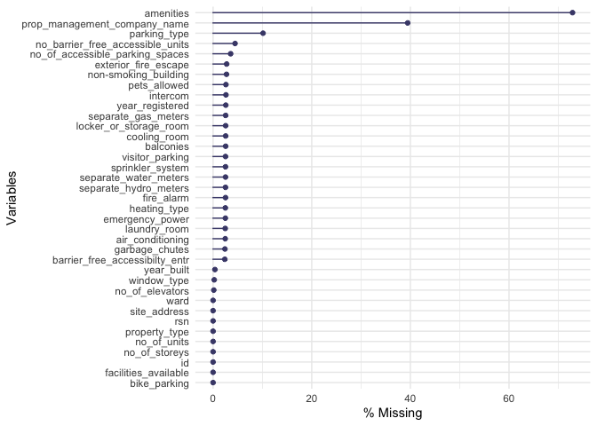<!-- -->

The above plot creates a visual analogue of the missing data (in %ge)
with variables plotted in order of the missing data. Clearly, data with
*amenities* consists of maximum percentage of missing data. Hoever, it
does not affect out data analysis as this variable has been considered
out of scope of the research question formed earlier. Since, we have
prepared a data subset, let us look at the missing data in
**sub_apt_building**

``` r
gg_miss_var(sub_apt_buildings, show_pct = TRUE)
```

    ## Warning: It is deprecated to specify `guide = FALSE` to remove a guide. Please
    ## use `guide = "none"` instead.

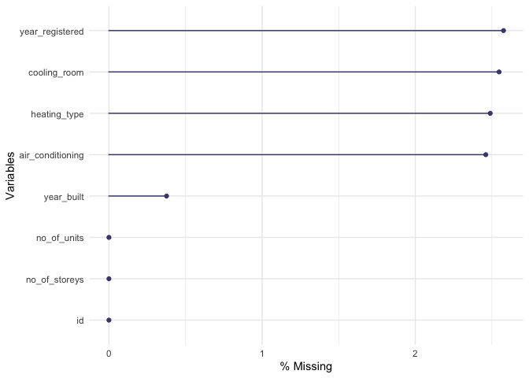<!-- -->

To keep the data analysis **meaningful** for all the combinations of
categories (heating, cooling, age etc.), I am dropping the missing data
entries using *drop_na()* function from dplyr. This might include
additional uncertainty in the results as some of the non-registered
buildings might have been entries in different categories. Hence,
following analysis will consider about the buildings which are
registered under Toronto Building Authority. This will keep the analysis
clean and meaningful for future policy relevant understandings.

#### Creating a new variable for analysis (removing all NA)

For the analysis, I am creating a new feature called “Decade” from the
variable *year_built*. This will provide us about the understanding the
time period of build development. Whether the buildings were developed
in a particular period or if it follows a particular event in history. I
am using a function *floor()* which returns the rounded down value to
the nearest integer.

``` r
sub_apt_buildings = 
  sub_apt_buildings %>% 
  drop_na() %>% 
  mutate(Decade = floor(year_built/10)*10) # --> floor() 
```

#### Plotting the Decadal results of Building Developement:

Now let’s visualize the number of buildings developed by each decade
across the records. To visualize this, I am using a bar plot for the
entries (counts) in each decade.

``` r
sub_apt_buildings %>%
  ggplot(.,aes(x = Decade))+  
  geom_bar()+
  scale_y_continuous(trans='log10')+ # --> log transformation for better visualization
  labs(x = "Decade", y = "Count", title= "Number of Buildings Developed")+ # --> axis formatting
  theme_classic()+
  theme(axis.title.x = element_text(color="Black", size=12, face="bold"), # --> axis formatting
        axis.title.y = element_text(color="Black", size=12, face="bold"), # --> axis formatting
        plot.title = element_text(size=14, face="bold",hjust = 0.5)) # --> Title formating
```

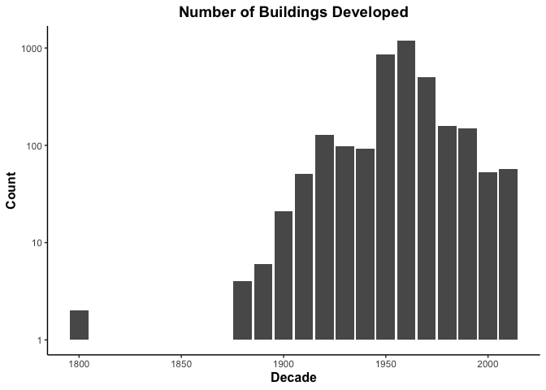<!-- -->

This bar-plot shows the decade-wise building development in the Toronto
area. I have log-transformed the count values (y-axis) for better
visualization in the data. It is clear that some registered buildings
are very old, built in decade 1800, followed by a huge gap of about 8
decades. For the sake of analysis, I am removing the old buildings by
filtering (decade \< 1880) data.

``` r
filt_sub_apt_buildings = 
  sub_apt_buildings %>% filter(Decade>=1880) # --> keeping data from decade 1880
```

Now plotting again to have better visualization

``` r
filt_sub_apt_buildings %>%
  ggplot(.,aes(x = Decade))+  
  geom_bar()+
  scale_y_continuous(trans='log10')+ # --> log transformation for better visualization
  labs(x = "Decade", y = "Count", title= "Number of Buildings Developed after 1880")+ # --> axis formatting
  theme_classic()+
  theme(axis.title.x = element_text(color="Black", size=12, face="bold"), # --> axis formatting
        axis.title.y = element_text(color="Black", size=12, face="bold"), # --> axis formatting
        plot.title = element_text(size=14, face="bold",hjust = 0.5)) # --> Title formating
```

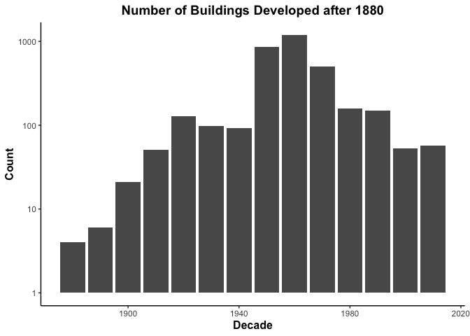<!-- -->

To get the top three decades where most of the buildings were developed,
I use the following code chunk.

``` r
filt_sub_apt_buildings %>% 
  count(Decade, sort = TRUE) %>% # sorting year based on the number of buildings built
  slice(1:3) %>%  # selecting the top three 
  kbl(align = "c", booktabs = T, 
      caption = "<center><strong>Top Three Decades</strong></center>") 
```

<table>
<caption>
<center>
<strong>Top Three Decades</strong>
</center>
</caption>
<thead>
<tr>
<th style="text-align:center;">
Decade
</th>
<th style="text-align:center;">
n
</th>
</tr>
</thead>
<tbody>
<tr>
<td style="text-align:center;">
1960
</td>
<td style="text-align:center;">
1184
</td>
</tr>
<tr>
<td style="text-align:center;">
1950
</td>
<td style="text-align:center;">
852
</td>
</tr>
<tr>
<td style="text-align:center;">
1970
</td>
<td style="text-align:center;">
500
</td>
</tr>
</tbody>
</table>

It is clear that, 1950 - 1970 was the peak period of construction. This
boom in building development overlaps with the apartment bloom in 1960s.

#### Analyzing Building’s Age

First we have to know which year is the latest built-year as per the
records

``` r
max(sub_apt_buildings$year_built)
```

    ## [1] 2019

The latest built is in the year **2019**

Hence, Age of Building (**building_age**) = 2019 - year_built

Creating a new numerical variable **building_age** from the records.

``` r
# calculating building_age
filt_sub_apt_buildings = filt_sub_apt_buildings %>% 
  mutate(building_age = 2019 - year_built)
```

Let us visualize the age distribution of the buildings using histogram.

``` r
# Building Age Distribution
filt_sub_apt_buildings %>% 
  ggplot(.,aes(x = building_age))+
  geom_histogram(color="black", fill="blue")+ # --> formatting appearance
  labs(x = "Building Age (years)", y = "Count", title= "Age of Building Developed")+ # --> axis formatting
  theme_classic()+
  ylim(0,600)+
  theme(axis.title.x = element_text(color="Black", size=12, face="bold"), # --> axis formatting
        axis.title.y = element_text(color="Black", size=12, face="bold"), # --> axis formatting
        plot.title = element_text(size=14, face="bold",hjust = 0.5)) # --> Title formating
```

    ## `stat_bin()` using `bins = 30`. Pick better value with `binwidth`.

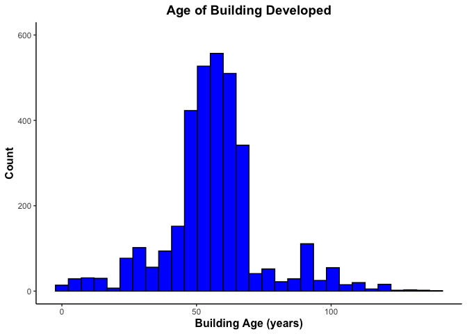<!-- -->

##### Heating System by building age:

To visualize the building age by the Heating type installed, I am using
box plots to know the range of different categories.

``` r
filt_sub_apt_buildings %>% 
  ggplot(.,aes(x = building_age, y = heating_type))+
  geom_boxplot()+
  labs(x = "Building Age (years)", y = "Heating Type", 
       title= "Boxplot of Building age by Heating Type")+ # --> axis formatting
  theme_classic()+
  theme(axis.title.x = element_text(color="Black", size=12, face="bold"), # --> axis formatting
        axis.title.y = element_text(color="Black", size=12, face="bold"), # --> axis formatting
        plot.title = element_text(size=14, face="bold",hjust = 0.5)) # --> Title formatting
```

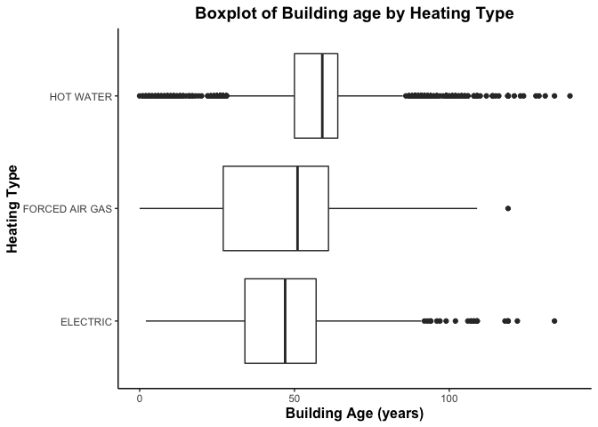<!-- -->

##### Cooling System by building age:

How about the building age with installed air-conditioning facilities?
Boxplots produced from the different categories.

``` r
filt_sub_apt_buildings %>% 
  ggplot(.,aes(x = building_age, y = air_conditioning))+
  geom_boxplot()+
  labs(x = "Building Age (years)", y = "Air Conditioning Type", 
       title= "Boxplot of Building age by Air Conditioning Type")+ # --> axis formatting
  theme_classic()+
  theme(axis.title.x = element_text(color="Black", size=12, face="bold"), # --> axis formatting
        axis.title.y = element_text(color="Black", size=12, face="bold"), # --> axis formatting
        plot.title = element_text(size=14, face="bold",hjust = 0.5)) # --> Title formatting
```

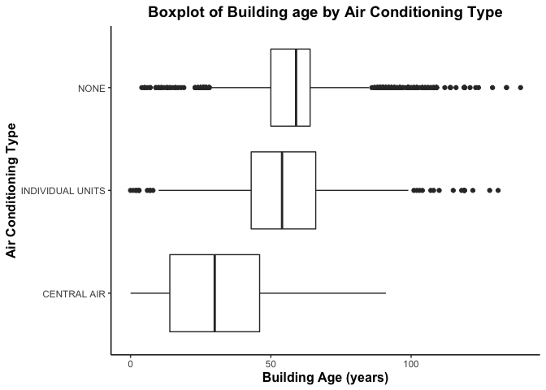<!-- -->

##### Cooling-Room Availability by Building Age:

Does the cooling room availability ranged to different building age?
Boxplots produced following previous procedure.

``` r
filt_sub_apt_buildings %>% 
  ggplot(.,aes(x = building_age, y = cooling_room))+
  geom_boxplot()+
  labs(x = "Building Age (years)", y = "Cooling Room", 
       title= "Boxplot of Building age by Cooling Room Availability")+ # --> axis formatting
  theme_classic()+
  theme(axis.title.x = element_text(color="Black", size=12, face="bold"), # --> axis formatting
        axis.title.y = element_text(color="Black", size=12, face="bold"), # --> axis formatting
        plot.title = element_text(size=14, face="bold",hjust = 0.5)) # --> Title formatting
```

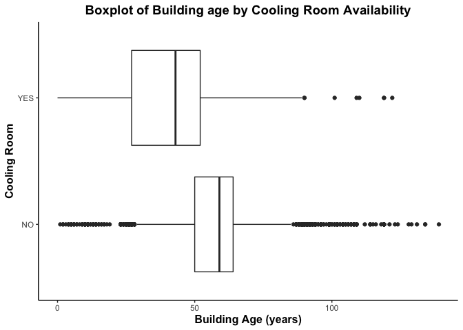<!-- -->

<!----------------------------------------------------------------------------->

# Task 3: Write your research questions (5 points)

So far, you have chosen a dataset and gotten familiar with it through
exploring the data. Now it’s time to figure out 4 research questions
that you would like to answer with your data! Write the 4 questions and
any additional comments at the end of this deliverable. These questions
are not necessarily set in stone - TAs will review them and give you
feedback; therefore, you may choose to pursue them as they are for the
rest of the project, or make modifications!

<!--- *****START HERE***** --->

### Research Questions

-   Question 1: Does the heating system installed in the building
    related to the building age?

-   Question 2: Does the air-conditioning system installed in the
    building related to the building age?

-   Question 3: What type of buildings are tend to have cooling-room
    facility?

-   Question 4: Is there any evidence of relationship in heating-cooling
    system in the registered buildings of Toronto?

-   Additional Comments: These questions were formulated based on the
    previous data exploration and visualzations.

# Task 4: Process and summarize your data (13 points)

From Task 2, you should have an idea of the basic structure of your
dataset (e.g. number of rows and columns, class types, etc.). Here, we
will start investigating your data more in-depth using various data
manipulation functions.

### 1.1 (10 points)

Now, for each of your four research questions, choose one task from
options 1-4 (summarizing), and one other task from 4-8 (graphing). You
should have 2 tasks done for each research question (8 total). Make sure
it makes sense to do them! (e.g. don’t use a numerical variables for a
task that needs a categorical variable.). Comment on why each task helps
(or doesn’t!) answer the corresponding research question.

Ensure that the output of each operation is printed!

**Summarizing:**

1.  Compute the *range*, *mean*, and *two other summary statistics* of
    **one numerical variable** across the groups of **one categorical
    variable** from your data.

2.  Compute the number of observations for at least one of your
    categorical variables. Do not use the function `table()`!

3.  Create a categorical variable with 3 or more groups from an existing
    numerical variable. You can use this new variable in the other
    tasks! *An example: age in years into “child, teen, adult, senior”.*

4.  Based on two categorical variables, calculate two summary statistics
    of your choosing.

**Graphing:**

5.  Create a graph out of summarized variables that has at least two
    geom layers.
6.  Create a graph of your choosing, make one of the axes logarithmic,
    and format the axes labels so that they are “pretty” or easier to
    read.
7.  Make a graph where it makes sense to customize the alpha
    transparency.
8.  Create 3 histograms out of summarized variables, with each histogram
    having different sized bins. Pick the “best” one and explain why it
    is the best.

Make sure it’s clear what research question you are doing each operation
for!

<!------------------------- Start your work below ----------------------------->

-   Question 1: Does the heating system installed in the building
    related to the building age?
-   Question 2: Does the air-conditioning system installed in the
    building related to the building age?
-   Question 3: What type of buildings are tend to have cooling-room
    facility?
-   Question 4: Is there any evidence of relationship in heating-cooling
    system in the registered buildings of Toronto?

#### Research Question 1: Does the heating system installed in the building related to the building age?

-   summarizing data

``` r
filt_sub_apt_buildings %>% 
  ungroup() %>% # --> ungrouping data 
  group_by(heating_type) %>% # --> grouping data 
  summarise(MeanAge = mean(building_age), ##--> calculating mean age of buildings
            MinAge = min(building_age), ##--> calculating Minimum age of buildings
            MaxAge = max(building_age), ##--> calculating Maximum age of buildings
            MedianAge = median(building_age)) ##--> calculating median age of buildings
```

    ## # A tibble: 3 × 5
    ##   heating_type   MeanAge MinAge MaxAge MedianAge
    ##   <fct>            <dbl>  <dbl>  <dbl>     <dbl>
    ## 1 ELECTRIC          51.3      2    134        47
    ## 2 FORCED AIR GAS    47.5      0    119        51
    ## 3 HOT WATER         58.2      0    139        59

-   graphing

``` r
filt_sub_apt_buildings %>% 
  ggplot(.,aes(x = building_age, y = heating_type))+
  geom_boxplot()+
  labs(x = "Building Age (years)", y = "Cooling Room", 
       title= "Boxplot of Building age by Cooling Room Availability")+ # --> axis formatting
  theme_classic()+
  theme(axis.title.x = element_text(color="Black", size=12, face="bold"), # --> axis formatting
        axis.title.y = element_text(color="Black", size=12, face="bold"), # --> axis formatting
        plot.title = element_text(size=14, face="bold",hjust = 0.5)) # --> Title formatting
```

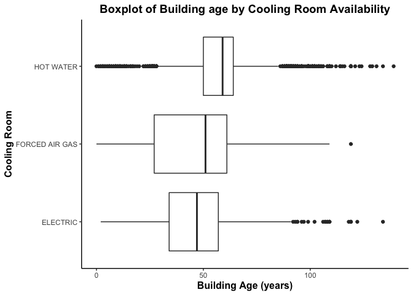<!-- -->

-   comment

#### Research Question 2: Does the air-conditioning system installed in the building related to the building age?

-   summarizing

``` r
filt_sub_apt_buildings %>% 
  ungroup() %>% # --> ungrouping data 
  group_by(air_conditioning) %>% # --> grouping data 
  summarise(MeanAge = mean(building_age), ##--> calculating mean age of buildings
            MinAge = min(building_age), ##--> calculating Minimum age of buildings
            MaxAge = max(building_age), ##--> calculating Maximum age of buildings
            MedianAge = median(building_age)) ##--> calculating median age of buildings
```

    ## # A tibble: 3 × 5
    ##   air_conditioning MeanAge MinAge MaxAge MedianAge
    ##   <fct>              <dbl>  <dbl>  <dbl>     <dbl>
    ## 1 CENTRAL AIR         31.4      0     91        30
    ## 2 INDIVIDUAL UNITS    55.8      0    131        54
    ## 3 NONE                58.6      4    139        59

-   graphing

``` r
filt_sub_apt_buildings %>% 
  ggplot(.,aes(x = building_age, y = air_conditioning))+
  geom_boxplot()+
  labs(x = "Building Age (years)", y = "Cooling Room", 
       title= "Boxplot of Building age by Cooling Room Availability")+ # --> axis formatting
  theme_classic()+
  theme(axis.title.x = element_text(color="Black", size=12, face="bold"), # --> axis formatting
        axis.title.y = element_text(color="Black", size=12, face="bold"), # --> axis formatting
        plot.title = element_text(size=14, face="bold",hjust = 0.5)) # --> Title formatting
```

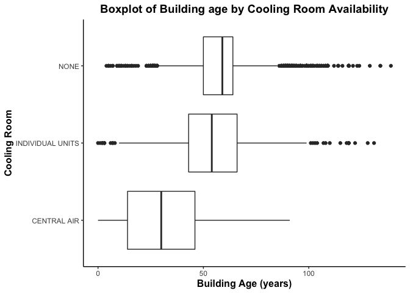<!-- -->

-   comment

#### Research Question 3: What type of buildings are tend to have cooling-room facility?

-   summarizing

``` r
filt_sub_apt_buildings %>% 
  ungroup() %>% # --> ungrouping data 
  group_by(cooling_room) %>% # --> grouping data 
  summarise(MeanAge = mean(building_age), ##--> calculating mean age of buildings
            MinAge = min(building_age), ##--> calculating Minimum age of buildings
            MaxAge = max(building_age), ##--> calculating Maximum age of buildings
            MedianAge = median(building_age)) ##--> calculating median age of buildings
```

    ## # A tibble: 2 × 5
    ##   cooling_room MeanAge MinAge MaxAge MedianAge
    ##   <fct>          <dbl>  <dbl>  <dbl>     <dbl>
    ## 1 NO              58.9      1    139        59
    ## 2 YES             40.6      0    122        43

-   graphing

``` r
filt_sub_apt_buildings %>% 
  ggplot(.,aes(x = building_age, y = cooling_room))+
  geom_boxplot()+
  labs(x = "Building Age (years)", y = "Cooling Room", 
       title= "Boxplot of Building age by Cooling Room Availability")+ # --> axis formatting
  theme_classic()+
  theme(axis.title.x = element_text(color="Black", size=12, face="bold"), # --> axis formatting
        axis.title.y = element_text(color="Black", size=12, face="bold"), # --> axis formatting
        plot.title = element_text(size=14, face="bold",hjust = 0.5)) # --> Title formatting
```

<!-- -->

-   comment

#### Research Question 4:

-   summarizing
-   graphing
-   comment

``` r
names(apt_buildings)
```

    ##  [1] "id"                               "air_conditioning"                
    ##  [3] "amenities"                        "balconies"                       
    ##  [5] "barrier_free_accessibilty_entr"   "bike_parking"                    
    ##  [7] "exterior_fire_escape"             "fire_alarm"                      
    ##  [9] "garbage_chutes"                   "heating_type"                    
    ## [11] "intercom"                         "laundry_room"                    
    ## [13] "locker_or_storage_room"           "no_of_elevators"                 
    ## [15] "parking_type"                     "pets_allowed"                    
    ## [17] "prop_management_company_name"     "property_type"                   
    ## [19] "rsn"                              "separate_gas_meters"             
    ## [21] "separate_hydro_meters"            "separate_water_meters"           
    ## [23] "site_address"                     "sprinkler_system"                
    ## [25] "visitor_parking"                  "ward"                            
    ## [27] "window_type"                      "year_built"                      
    ## [29] "year_registered"                  "no_of_storeys"                   
    ## [31] "emergency_power"                  "non-smoking_building"            
    ## [33] "no_of_units"                      "no_of_accessible_parking_spaces" 
    ## [35] "facilities_available"             "cooling_room"                    
    ## [37] "no_barrier_free_accessible_units"

``` r
apt_buildings %>% group_by(air_conditioning) %>% 
  summarize(n = n())
```

    ## # A tibble: 4 × 2
    ##   air_conditioning     n
    ##   <chr>            <int>
    ## 1 CENTRAL AIR        211
    ## 2 INDIVIDUAL UNITS   289
    ## 3 NONE              2870
    ## 4 <NA>                85

``` r
apt_buildings %>% group_by(no_of_storeys) %>% 
  summarize(n = n()) %>% 
  ggplot(.,aes(x = no_of_storeys, y = n))+
  geom_bar(stat = "identity")
```

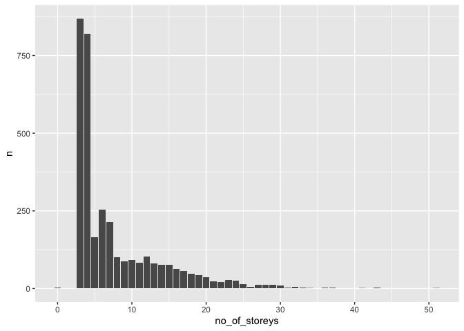<!-- -->

``` r
apt_buildings %>% group_by(year_built) %>% 
  summarise(n = n()) %>% 
  ggplot(.,aes(x = year_built, y = n))+
  geom_bar(stat = "identity")
```

    ## Warning: Removed 1 rows containing missing values (position_stack).

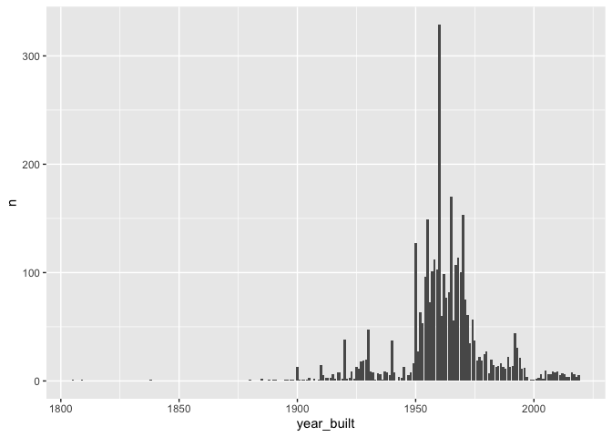<!-- -->

``` r
apt_buildings %>% group_by(year_registered) %>% 
  summarise(n = n()) %>% 
  ggplot(.,aes(x = year_registered, y = n))+
  geom_bar(stat = "identity")
```

    ## Warning: Removed 1 rows containing missing values (position_stack).

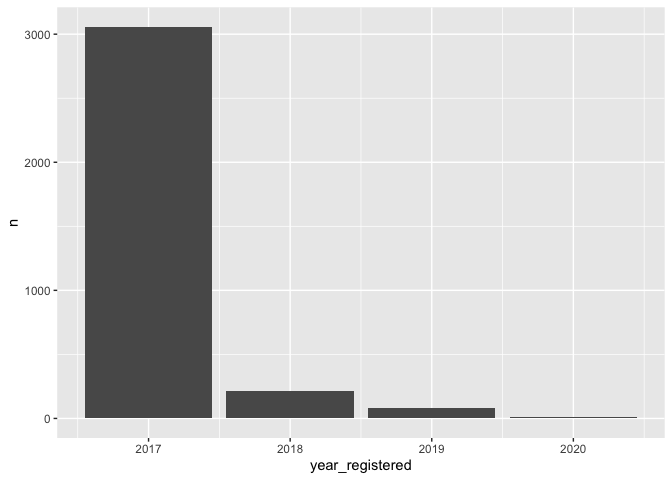<!-- -->

``` r
apt_buildings %>% group_by(heating_type) %>% 
  summarise(n = n()) %>% 
  ggplot(.,aes(x = heating_type, y = n))+
  geom_bar(stat = "identity")
```

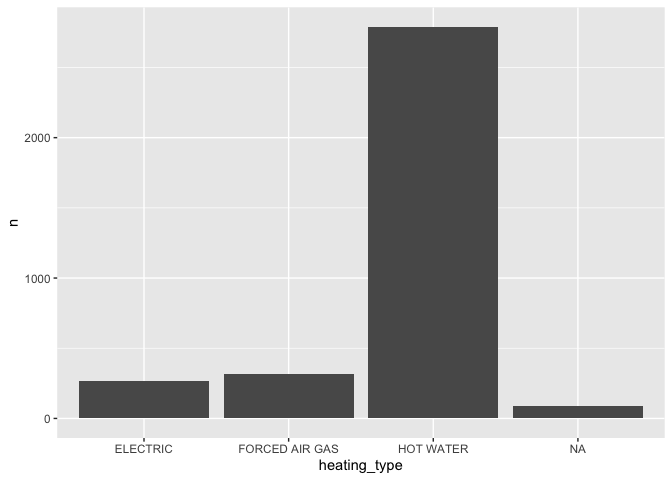<!-- -->

``` r
apt_buildings %>% group_by(laundry_room) %>% 
  summarise(n = n()) %>% 
  ggplot(.,aes(x = laundry_room, y = n))+
  geom_bar(stat = "identity")
```

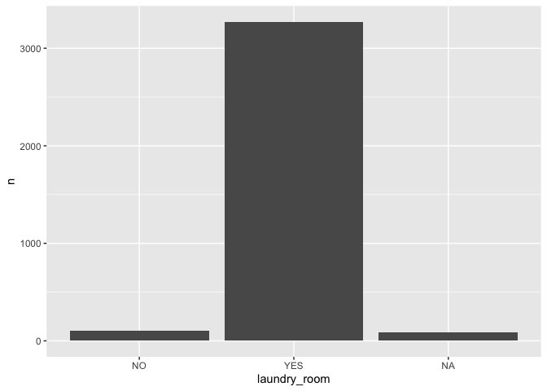<!-- -->

``` r
apt_buildings %>% group_by(property_type) %>% 
  summarise(n = n()) %>% 
  ggplot(.,aes(x = property_type, y = n))+
  geom_bar(stat = "identity")
```

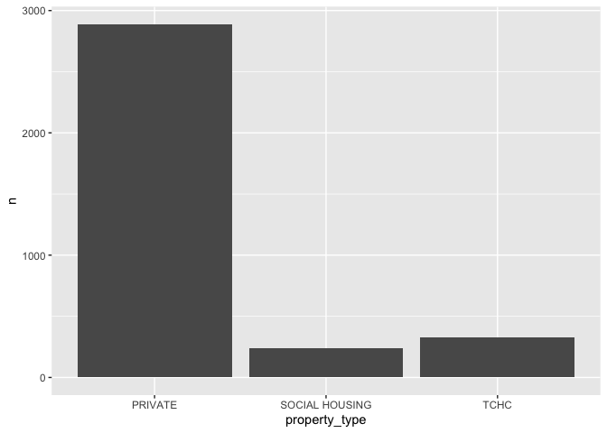<!-- -->

<!----------------------------------------------------------------------------->

### 1.2 (3 points)

Based on the operations that you’ve completed, how much closer are you
to answering your research questions? Think about what aspects of your
research questions remain unclear. Can your research questions be
refined, now that you’ve investigated your data a bit more? Which
research questions are yielding interesting results?

<!-------------------------- Start your work below ---------------------------->
<!----------------------------------------------------------------------------->

### Attribution

Thanks to Icíar Fernández Boyano for mostly putting this together, and
Vincenzo Coia for launching.
