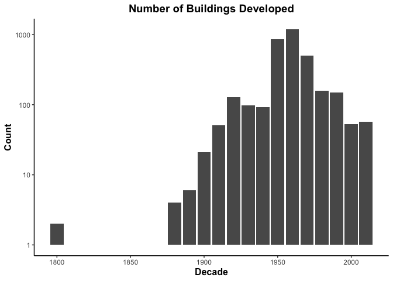

Mini Data Analysis Milestone 2
================

# Welcome to your second (and last) milestone in your mini data analysis project!

In Milestone 1, you explored your data, came up with research questions,
and obtained some results by making summary tables and graphs. This
time, we will first explore more in depth the concept of *tidy data.*
Then, you’ll be sharpening some of the results you obtained from your
previous milestone by:

-   Manipulating special data types in R: factors and/or dates and
    times.
-   Fitting a model object to your data, and extract a result.
-   Reading and writing data as separate files.

**NOTE**: The main purpose of the mini data analysis is to integrate
what you learn in class in an analysis. Although each milestone provides
a framework for you to conduct your analysis, it’s possible that you
might find the instructions too rigid for your data set. If this is the
case, you may deviate from the instructions – just make sure you’re
demonstrating a wide range of tools and techniques taught in this class.

# Instructions

**To complete this milestone**, edit [this very `.Rmd`
file](https://raw.githubusercontent.com/UBC-STAT/stat545.stat.ubc.ca/master/content/mini-project/mini-project-2.Rmd)
directly. Fill in the sections that are tagged with
`<!--- start your work here--->`.

**To submit this milestone**, make sure to knit this `.Rmd` file to an
`.md` file by changing the YAML output settings from
`output: html_document` to `output: github_document`. Commit and push
all of your work to your mini-analysis GitHub repository, and tag a
release on GitHub. Then, submit a link to your tagged release on canvas.

**Points**: This milestone is worth 55 points (compared to the 45 points
of the Milestone 1): 45 for your analysis, and 10 for your entire
mini-analysis GitHub repository. Details follow.

**Research Questions**: In Milestone 1, you chose two research questions
to focus on. Wherever realistic, your work in this milestone should
relate to these research questions whenever we ask for justification
behind your work. In the case that some tasks in this milestone don’t
align well with one of your research questions, feel free to discuss
your results in the context of a different research question.

# Learning Objectives

By the end of this milestone, you should:

-   Understand what *tidy* data is, and how to create it using `tidyr`.
-   Generate a reproducible and clear report using R Markdown.
-   Manipulating special data types in R: factors and/or dates and
    times.
-   Fitting a model object to your data, and extract a result.
-   Reading and writing data as separate files.

# Setup

Begin by loading your data and the tidyverse package below:

``` r
library(datateachr) # <- might contain the data you picked!
library(tidyverse)
```

    ## Warning: package 'readr' was built under R version 4.0.5

``` r
# additional libraries
library(ggpubr)
library(scales)
library(broom)
library(here)
```

# Task 1: Tidy your data (15 points)

In this task, we will do several exercises to reshape our data. The goal
here is to understand how to do this reshaping with the `tidyr` package.

A reminder of the definition of *tidy* data:

-   Each row is an **observation**
-   Each column is a **variable**
-   Each cell is a **value**

*Tidy’ing* data is sometimes necessary because it can simplify
computation. Other times it can be nice to organize data so that it can
be easier to understand when read manually.

### 2.1 (2.5 points)

Based on the definition above, can you identify if your data is tidy or
untidy? Go through all your columns, or if you have \>8 variables, just
pick 8, and explain whether the data is untidy or tidy.

<!--------------------------- Start your work below --------------------------->

In the MDA deliverable \#1, I chose to work with *apt_buildings*. In my
previous analysis, I choose to work with 8 variables for the reserach
question I have developed. Let’s quickly check how the original data
looked like.

``` r
# checking the structure of dataframe
str(apt_buildings)
```

    ## tibble [3,455 × 37] (S3: tbl_df/tbl/data.frame)
    ##  $ id                              : num [1:3455] 10359 10360 10361 10362 10363 ...
    ##  $ air_conditioning                : chr [1:3455] "NONE" "NONE" "NONE" "NONE" ...
    ##  $ amenities                       : chr [1:3455] "Outdoor rec facilities" "Outdoor pool" NA NA ...
    ##  $ balconies                       : chr [1:3455] "YES" "YES" "YES" "YES" ...
    ##  $ barrier_free_accessibilty_entr  : chr [1:3455] "YES" "NO" "NO" "YES" ...
    ##  $ bike_parking                    : chr [1:3455] "0 indoor parking spots and 10 outdoor parking spots" "0 indoor parking spots and 34 outdoor parking spots" "Not Available" "Not Available" ...
    ##  $ exterior_fire_escape            : chr [1:3455] "NO" "NO" "NO" "YES" ...
    ##  $ fire_alarm                      : chr [1:3455] "YES" "YES" "YES" "YES" ...
    ##  $ garbage_chutes                  : chr [1:3455] "YES" "YES" "NO" "NO" ...
    ##  $ heating_type                    : chr [1:3455] "HOT WATER" "HOT WATER" "HOT WATER" "HOT WATER" ...
    ##  $ intercom                        : chr [1:3455] "YES" "YES" "YES" "YES" ...
    ##  $ laundry_room                    : chr [1:3455] "YES" "YES" "YES" "YES" ...
    ##  $ locker_or_storage_room          : chr [1:3455] "NO" "YES" "YES" "YES" ...
    ##  $ no_of_elevators                 : num [1:3455] 3 3 0 1 0 0 0 2 4 2 ...
    ##  $ parking_type                    : chr [1:3455] "Underground Garage , Garage accessible thru buildg" "Underground Garage , Garage accessible thru buildg , Surface Parking" "Underground Garage , Garage accessible thru buildg , Surface Parking" "Ground Level Garage , Surface Parking" ...
    ##  $ pets_allowed                    : chr [1:3455] "YES" "YES" "YES" "YES" ...
    ##  $ prop_management_company_name    : chr [1:3455] NA "SCHICKEDANZ BROS. PROPERTIES" NA "FREIMAN INVESTMENTS" ...
    ##  $ property_type                   : chr [1:3455] "PRIVATE" "PRIVATE" "PRIVATE" "PRIVATE" ...
    ##  $ rsn                             : num [1:3455] 4154812 4154815 4155295 4155309 4155318 ...
    ##  $ separate_gas_meters             : chr [1:3455] "NO" "NO" "NO" "NO" ...
    ##  $ separate_hydro_meters           : chr [1:3455] "YES" "YES" "YES" "YES" ...
    ##  $ separate_water_meters           : chr [1:3455] "NO" "NO" "NO" "NO" ...
    ##  $ site_address                    : chr [1:3455] "65  FOREST MANOR RD" "70  CLIPPER RD" "2651  BLOOR ST W" "22  BURNHAMTHORPE RD" ...
    ##  $ sprinkler_system                : chr [1:3455] "YES" "YES" "NO" "YES" ...
    ##  $ visitor_parking                 : chr [1:3455] "PAID" "FREE" "UNAVAILABLE" "UNAVAILABLE" ...
    ##  $ ward                            : chr [1:3455] "17" "17" "03" "03" ...
    ##  $ window_type                     : chr [1:3455] "DOUBLE PANE" "DOUBLE PANE" "DOUBLE PANE" "DOUBLE PANE" ...
    ##  $ year_built                      : num [1:3455] 1967 1970 1927 1959 1943 ...
    ##  $ year_registered                 : num [1:3455] 2017 2017 2017 2017 2017 ...
    ##  $ no_of_storeys                   : num [1:3455] 17 14 4 5 4 4 4 7 32 4 ...
    ##  $ emergency_power                 : chr [1:3455] "NO" "YES" "NO" "NO" ...
    ##  $ non-smoking_building            : chr [1:3455] "YES" "NO" "YES" "YES" ...
    ##  $ no_of_units                     : num [1:3455] 218 206 34 42 25 34 14 105 571 171 ...
    ##  $ no_of_accessible_parking_spaces : num [1:3455] 8 10 20 42 12 0 5 1 1 6 ...
    ##  $ facilities_available            : chr [1:3455] "Recycling bins" "Green Bin / Organics" "Green Bin / Organics" "Green Bin / Organics" ...
    ##  $ cooling_room                    : chr [1:3455] "NO" "NO" "NO" "NO" ...
    ##  $ no_barrier_free_accessible_units: num [1:3455] 2 0 0 42 0 NA 14 0 0 1 ...

Out of the 37 variables in *apt_buildings*, I choose the following
variables.

1.  **air_conditioning**: Does the building have an air conditioner? If
    so, is it central or in individual units? This is a *categorical*
    variable, which could have a major influence on the research
    question.
2.  **year_built**: Year the building was built. This numerical data set
    can be converted into YEAR (time series) for analysing temporal
    trend in dataset.
3.  **year_registered**: Year that the building was registered in the
    ABS (Apartment Building Registered) program. Some of the buildings
    and it’s units can be old. However, I assume when the buildings were
    registered, they follow the bylaws of the local authority. Upon
    searching (Link:
    <https://ckan0.cf.opendata.inter.prod-toronto.ca/tr/dataset/apartment-building-registration>),
    I identified that buildings with 3 or more storeys and 10 or more
    units required registration. However, to avoid any bias in the
    results, the data needs to be verified in such contexts before
    performing any analysis.
4.  **no_of_storeys**: Number of storeys in the building. Important
    criteria for getting idea about building’s height, which might
    impact the heating/cooling system.
5.  **no_of_units**: Number of units present in the building. This
    variable can profice information about the capacity of building.
6.  **heating_type**: How is the building heated? A categorical variable
    provides informations about the building heating information.
7.  **cooling_room**: Does the building have a cooling room? Provides
    information about the centralized amenities if there are no
    air-conditioning installed.

#### Creating an updated dataset

``` r
# select the required columns
sub_apt_buildings = apt_buildings %>% 
  select(id, air_conditioning, year_built, year_registered, no_of_storeys, no_of_units,
                                             heating_type, cooling_room) 

# check the structure of the tibble
str(sub_apt_buildings)
```

    ## tibble [3,455 × 8] (S3: tbl_df/tbl/data.frame)
    ##  $ id              : num [1:3455] 10359 10360 10361 10362 10363 ...
    ##  $ air_conditioning: chr [1:3455] "NONE" "NONE" "NONE" "NONE" ...
    ##  $ year_built      : num [1:3455] 1967 1970 1927 1959 1943 ...
    ##  $ year_registered : num [1:3455] 2017 2017 2017 2017 2017 ...
    ##  $ no_of_storeys   : num [1:3455] 17 14 4 5 4 4 4 7 32 4 ...
    ##  $ no_of_units     : num [1:3455] 218 206 34 42 25 34 14 105 571 171 ...
    ##  $ heating_type    : chr [1:3455] "HOT WATER" "HOT WATER" "HOT WATER" "HOT WATER" ...
    ##  $ cooling_room    : chr [1:3455] "NO" "NO" "NO" "NO" ...

From here, I will continue to work with *sub_apt_buildings* dataframe.

#### tidy data check

First, I check the summary of the tibble.

``` r
sub_apt_buildings %>% 
  summary()
```

    ##        id        air_conditioning     year_built   year_registered
    ##  Min.   :10359   Length:3455        Min.   :1805   Min.   :2017   
    ##  1st Qu.:11222   Class :character   1st Qu.:1955   1st Qu.:2017   
    ##  Median :12086   Mode  :character   Median :1962   Median :2017   
    ##  Mean   :12086                      Mean   :1962   Mean   :2017   
    ##  3rd Qu.:12950                      3rd Qu.:1970   3rd Qu.:2017   
    ##  Max.   :13813                      Max.   :2019   Max.   :2020   
    ##                                     NA's   :13     NA's   :89     
    ##  no_of_storeys     no_of_units      heating_type       cooling_room      
    ##  Min.   : 0.000   Min.   :   0.00   Length:3455        Length:3455       
    ##  1st Qu.: 3.000   1st Qu.:  25.00   Class :character   Class :character  
    ##  Median : 5.000   Median :  52.00   Mode  :character   Mode  :character  
    ##  Mean   : 7.738   Mean   :  91.09                                        
    ##  3rd Qu.:10.000   3rd Qu.: 124.00                                        
    ##  Max.   :51.000   Max.   :4111.00                                        
    ## 

**Comments**

1.  Column headers are variable names, not values :white_check_mark:
2.  Columns “id”,
    “year_built”,“year_registered”,“no_of_storeys”,“no_of_units” are
    numeric :white_check_mark:
3.  Columns “air_conditioning”,“heating_type” and “cooling_room” are
    character variables :white_check_mark:
4.  Is *sub_apt_buildings* a tidy data?

-   Each row is an **observation** :white_check_mark:
-   Each column is a **variable** :white_check_mark:
-   Each cell is a **value** :white_check_mark:
-   Conclusion: **YES**

<!----------------------------------------------------------------------------->

### 2.2 (5 points)

Now, if your data is tidy, untidy it! Then, tidy it back to it’s
original state.

If your data is untidy, then tidy it! Then, untidy it back to it’s
original state.

Be sure to explain your reasoning for this task. Show us the “before”
and “after”.

<!--------------------------- Start your work below --------------------------->

#### Undidying *sub_apt_buildings*

The concept of tidy data can change based on the objective of data
analysis. The difference in messy and tidy can vary based on - the
objectives or goals of data usage (e.g., if we are to look at the
relation of heating system installed only, we would prepare data based
on heating types) - the tools or packages (*dplyr* and *ggplot2*) which
will be used for analysis and visualization (e.g., in what form the
variable of interest are, if variables can be used to group, select or
summarize data)

A classic example of *sub_apt_buildings* untidy/messy data will be when
we have individual year as columns.

``` r
untidy_sub_apt_buildings = 
  sub_apt_buildings %>% 
  drop_na() %>%  ##-> dropping NA values
  pivot_wider(names_from = year_registered, 
              names_prefix = "heating_",
              values_from = heating_type)

head(untidy_sub_apt_buildings)
```

    ## # A tibble: 6 × 10
    ##      id air_co…¹ year_…² no_of…³ no_of…⁴ cooli…⁵ heati…⁶ heati…⁷ heati…⁸ heati…⁹
    ##   <dbl> <chr>      <dbl>   <dbl>   <dbl> <chr>   <chr>   <chr>   <chr>   <chr>  
    ## 1 10359 NONE        1967      17     218 NO      HOT WA… <NA>    <NA>    <NA>   
    ## 2 10360 NONE        1970      14     206 NO      HOT WA… <NA>    <NA>    <NA>   
    ## 3 10361 NONE        1927       4      34 NO      HOT WA… <NA>    <NA>    <NA>   
    ## 4 10362 NONE        1959       5      42 NO      HOT WA… <NA>    <NA>    <NA>   
    ## 5 10363 NONE        1943       4      25 NO      HOT WA… <NA>    <NA>    <NA>   
    ## 6 10365 NONE        1959       4      14 NO      HOT WA… <NA>    <NA>    <NA>   
    ## # … with abbreviated variable names ¹​air_conditioning, ²​year_built,
    ## #   ³​no_of_storeys, ⁴​no_of_units, ⁵​cooling_room, ⁶​heating_2017, ⁷​heating_2018,
    ## #   ⁸​heating_2019, ⁹​heating_2020

We can call *untidy_sub_apt_buildings* untidy because the data frame
consists year of registration as columns, as in each year c(2017, 2018,
2019, 2020) are variables. This was achieved by widening the original
data by a variable *year_registered*. This data set may not be useful
for data filtering and summarizing when considering multi-variate
analysis. However, this dataset could be useful when someone is only
interested in looking at buildings registered in 2017. I am saying is
in-terms of ease of data handling. With thousands of data, it might be
better to consider widening data and look at a particular for analysis.
However, this is not the case in the present context.

#### Re-tidying the Undidy data

``` r
untidy_sub_apt_buildings %>% 
  pivot_longer(cols = c("heating_2017","heating_2018","heating_2019","heating_2020"),
               names_to = c(".value","year_registration"),
               names_sep = "_") %>% 
  head()
```

    ## # A tibble: 6 × 8
    ##      id air_conditioning year_built no_of_stor…¹ no_of…² cooli…³ year_…⁴ heating
    ##   <dbl> <chr>                 <dbl>        <dbl>   <dbl> <chr>   <chr>   <chr>  
    ## 1 10359 NONE                   1967           17     218 NO      2017    HOT WA…
    ## 2 10359 NONE                   1967           17     218 NO      2018    <NA>   
    ## 3 10359 NONE                   1967           17     218 NO      2019    <NA>   
    ## 4 10359 NONE                   1967           17     218 NO      2020    <NA>   
    ## 5 10360 NONE                   1970           14     206 NO      2017    HOT WA…
    ## 6 10360 NONE                   1970           14     206 NO      2018    <NA>   
    ## # … with abbreviated variable names ¹​no_of_storeys, ²​no_of_units,
    ## #   ³​cooling_room, ⁴​year_registration

<!----------------------------------------------------------------------------->

### 2.3 (7.5 points)

Now, you should be more familiar with your data, and also have made
progress in answering your research questions. Based on your interest,
and your analyses, pick 2 of the 4 research questions to continue your
analysis in the next four tasks:

<!-------------------------- Start your work below ---------------------------->

In MDA#1, I had developed four research questions

-   Question 1: Does the heating system installed in the building
    related to the building age?
-   Question 2: Does the air-conditioning system installed in the
    building related to the building age?
-   Question 3: What type of buildings are tend to have cooling-room
    facility?
-   Question 4: Is there any evidence of relationship in heating-cooling
    system in the registered buildings of Toronto?

From the research question, I am trying to identify two questions which
are relevant for further tasks and analysis.

1.  *Does the heating system installed in the building related to the
    building age*
2.  *Is there any evidence of relationship in heating-cooling system in
    the registered buildings of Toronto* o
    <!----------------------------------------------------------------------------->

Explain your decision for choosing the above two research questions.

<!--------------------------- Start your work below --------------------------->

These questions will help us understand the relationship of building
heating/cooling facility. The building data set is very complex has lots
of biases in terms of temporal evolution of buildings types and their
installation of heating/cooling facility. It will be interesting to
check if there are any association within types of building and the
heating/cooling facility. Here, I will explain the rationale behind the
different categories.

<!----------------------------------------------------------------------------->

Now, try to choose a version of your data that you think will be
appropriate to answer these 2 questions. Use between 4 and 8 functions
that we’ve covered so far (i.e. by filtering, cleaning, tidy’ing,
dropping irrelevant columns, etc.).

<!--------------------------- Start your work below --------------------------->

#### Data Processing

Firstly, I am creating new data columns for analysis which is often
mentioned as creating new features in the data set for data analysis.

##### Create: Decade

The variable “Decade” refers to the decade, in which data building was
built. Note: I am dropping all NA entries for data uniformity.

``` r
sub_apt_buildings = 
  sub_apt_buildings %>% 
  drop_na() %>% 
  mutate(Decade = floor(year_built/10)*10) # --> floor() 
```

In MDA#1, I have shown that there are few entries for Decade\<1880. This
is how we can visualize.

``` r
sub_apt_buildings %>%
  ggplot(.,aes(x = Decade))+  
  geom_bar()+
  scale_y_continuous(trans='log10')+ # --> log transformation for better visualization
  labs(x = "Decade", y = "Count", title= "Number of Buildings Developed")+ # --> axis formatting
  theme_classic()+
  theme(axis.title.x = element_text(color="Black", size=12, face="bold"), # --> axis formatting
        axis.title.y = element_text(color="Black", size=12, face="bold"), # --> axis formatting
        plot.title = element_text(size=14, face="bold",hjust = 0.5)) # --> Title formating
```

<!-- -->
Hence, we are filtering data for Decade\<1800

``` r
filt_sub_apt_buildings = 
  sub_apt_buildings %>% filter(Decade>=1880) # --> keeping data from decade 1880
```

Now plotting again to have better visualization

``` r
filt_sub_apt_buildings %>%
  ggplot(.,aes(x = Decade))+  
  geom_bar()+
  scale_y_continuous(trans='log10')+ # --> log transformation for better visualization
  labs(x = "Decade", y = "Count", title= "Number of Buildings Developed after 1880")+ # --> axis formatting
  theme_classic()+
  theme(axis.title.x = element_text(color="Black", size=12, face="bold"), # --> axis formatting
        axis.title.y = element_text(color="Black", size=12, face="bold"), # --> axis formatting
        plot.title = element_text(size=14, face="bold",hjust = 0.5)) # --> Title formating
```

<!-- -->
\##### Create : building_age

Creating a new numerical variable **building_age** from the records.

``` r
# calculating building_age
filt_sub_apt_buildings = filt_sub_apt_buildings %>% 
  mutate(building_age = 2019 - year_built)
```

Let us visualize the age distribution of the buildings using histogram.

``` r
# Building Age Distribution
filt_sub_apt_buildings %>% 
  ggplot(.,aes(x = building_age))+
  geom_histogram(color="black", fill="blue")+ # --> formatting appearance
  labs(x = "Building Age (years)", y = "Count", title= "Age of Building Developed")+ # --> axis formatting
  theme_classic()+
  ylim(0,600)+
  theme(axis.title.x = element_text(color="Black", size=12, face="bold"), # --> axis formatting
        axis.title.y = element_text(color="Black", size=12, face="bold"), # --> axis formatting
        plot.title = element_text(size=14, face="bold",hjust = 0.5)) # --> Title formatting
```

    ## `stat_bin()` using `bins = 30`. Pick better value with `binwidth`.

<!-- -->

##### Create : building_class

I am crating a new categorical variable based on building’s number of
storeys. The facilities in the building can be related to the building
storeys which are often manages by property managers and are often
heating/cooling facilities are well taken care of. The building
classification has been adopted from this study:
<https://www.mdpi.com/2071-1050/11/20/5663>

``` r
filt_sub_apt_buildings = filt_sub_apt_buildings %>% 
  mutate(building_class = case_when(no_of_storeys <=3 ~ "Low-Rise",
                                    no_of_storeys <=6 ~ "Multi-Story",
                                    no_of_storeys <=9 ~ "Middle-Rise",
                                    no_of_storeys <=16 ~ "Small_High-Rise",
                                    no_of_storeys <=40 ~ "High-Rise",
                                    TRUE ~ "Ultra_High-Rise"))
```

Now checking the count of different classes of building

``` r
filt_sub_apt_buildings %>% group_by(building_class) %>% 
  summarize(Count = n())
```

    ## # A tibble: 6 × 2
    ##   building_class  Count
    ##   <chr>           <int>
    ## 1 High-Rise         359
    ## 2 Low-Rise          813
    ## 3 Middle-Rise       395
    ## 4 Multi-Story      1208
    ## 5 Small_High-Rise   570
    ## 6 Ultra_High-Rise     5

##### Outlier Removal:

``` r
filt_sub_apt_buildings %>% 
  ggplot(.,aes(x = no_of_units, y = building_class))+
  geom_boxplot()
```

<!-- -->
Clearly, there is one entry in High-Rise category building which has
more than 4000 units and hence can be considered as outlier entry.By the
above visualization, I am considering a filter on no_of_units \<1000 and
creating a new tibble.

``` r
out_filt_sub_apt_buildings = filt_sub_apt_buildings %>% 
  filter(no_of_units<1000) 

out_filt_sub_apt_buildings %>% 
  ggplot(.,aes(x = no_of_units, y = building_class))+
  geom_boxplot()
```

<!-- --> Now
outlier data entry has been removed.

##### Final Dataset

``` r
# Make Character Variables as Factor

out_filt_sub_apt_buildings = 
  out_filt_sub_apt_buildings %>% 
  mutate(air_conditioning = as.factor(air_conditioning),
         heating_type = as.factor(heating_type),
         cooling_room = as.factor(cooling_room),
         building_class = as.factor(building_class))

#Check the structure of the final data
str(out_filt_sub_apt_buildings)
```

    ## tibble [3,349 × 11] (S3: tbl_df/tbl/data.frame)
    ##  $ id              : num [1:3349] 10359 10360 10361 10362 10363 ...
    ##  $ air_conditioning: Factor w/ 3 levels "CENTRAL AIR",..: 3 3 3 3 3 3 1 3 3 3 ...
    ##  $ year_built      : num [1:3349] 1967 1970 1927 1959 1943 ...
    ##  $ year_registered : num [1:3349] 2017 2017 2017 2017 2017 ...
    ##  $ no_of_storeys   : num [1:3349] 17 14 4 5 4 4 7 32 4 4 ...
    ##  $ no_of_units     : num [1:3349] 218 206 34 42 25 14 105 571 171 26 ...
    ##  $ heating_type    : Factor w/ 3 levels "ELECTRIC","FORCED AIR GAS",..: 3 3 3 3 3 3 3 1 3 3 ...
    ##  $ cooling_room    : Factor w/ 2 levels "NO","YES": 1 1 1 1 1 1 1 1 1 1 ...
    ##  $ Decade          : num [1:3349] 1960 1970 1920 1950 1940 1950 1970 1960 1970 1940 ...
    ##  $ building_age    : num [1:3349] 52 49 92 60 76 60 48 50 47 74 ...
    ##  $ building_class  : Factor w/ 6 levels "High-Rise","Low-Rise",..: 1 5 4 4 4 4 3 1 4 4 ...

<!----------------------------------------------------------------------------->

# Task 2: Special Data Types (10)

For this exercise, you’ll be choosing two of the three tasks below –
both tasks that you choose are worth 5 points each.

But first, tasks 1 and 2 below ask you to modify a plot you made in a
previous milestone. The plot you choose should involve plotting across
at least three groups (whether by facetting, or using an aesthetic like
colour). Place this plot below (you’re allowed to modify the plot if
you’d like). If you don’t have such a plot, you’ll need to make one.
Place the code for your plot below.

<!-------------------------- Start your work below ---------------------------->

##### The Plot

``` r
out_filt_sub_apt_buildings %>% 
  ggplot(.,aes(x = building_class, y = building_age))+
  geom_boxplot()
```

<!-- -->

<!----------------------------------------------------------------------------->

Now, choose two of the following tasks.

1.  Produce a new plot that reorders a factor in your original plot,
    using the `forcats` package (3 points). Then, in a sentence or two,
    briefly explain why you chose this ordering (1 point here for
    demonstrating understanding of the reordering, and 1 point for
    demonstrating some justification for the reordering, which could be
    subtle or speculative.)

2.  Produce a new plot that groups some factor levels together into an
    “other” category (or something similar), using the `forcats` package
    (3 points). Then, in a sentence or two, briefly explain why you
    chose this grouping (1 point here for demonstrating understanding of
    the grouping, and 1 point for demonstrating some justification for
    the grouping, which could be subtle or speculative.)

<!-------------------------- Start your work below ---------------------------->

**Task Number**: 1

``` r
out_filt_sub_apt_buildings %>% 
  ggplot(.,aes(x = building_class, y = building_age))+
  geom_boxplot()
```

<!-- --> From
the above plot, it is difficult to understand the building classes and
their age. As the factor variable, building_class is in reality a
ordinal variable, representing building size from low to high (based on
number of storeys), this visualization does not provide an ordinal
representation. Hence, the building class needs to be re-leveled using
forecats package. However, this processing could be avoided if we
mentioned the levels while creating the variable using case_when()
function.

``` r
out_filt_sub_apt_buildings %>% 
  mutate(building_class = fct_relevel(building_class, "Low-Rise","Multi-Story","Middle-Rise",
                                     "Small_High-Rise","High-Rise","Ultra_High-Rise")) %>% 
  ggplot(.,aes(x = building_age, y = building_class))+
  geom_boxplot()+
  labs(x = "Building Age (years)", y = "Building Classsification", 
       title= "Boxplot of Building age and Class by Cooling Room Availability")+ # --> axis formatting
  theme_pubr()+
  theme(axis.title.x = element_text(color="Black", size=12, face="bold"), # --> axis formatting
        axis.title.y = element_text(color="Black", size=12, face="bold"), # --> axis formatting
        plot.title = element_text(size=14, face="bold",hjust = 0.5)) # --> Title formatting
```

<!-- -->
Here, it is clearly visible that the building class is ordered based on
the building height, which is helpful to interpret.

<!----------------------------------------------------------------------------->
<!-------------------------- Start your work below ---------------------------->

**Task Number**: 2

2.  Produce a new plot that groups some factor levels together into an
    “other” category (or something similar), using the `forcats` package
    (3 points). Then, in a sentence or two, briefly explain why you
    chose this grouping (1 point here for demonstrating understanding of
    the grouping, and 1 point for demonstrating some justification for
    the grouping, which could be subtle or speculative.)

In this task, I am defining a new factor group *building_class2* which
is grouped by three types of building. - Low-Rise : by combining
“Low_Rise” and “Multi-Story” - Medium-Rise: building which are
previously classified as “Middle-Rise”. - High-Rise: by combining “Small
High-Rise”,“High-Rise”, and “Ultra High-Rise”

``` r
out_filt_sub_apt_buildings$building_class2 = 
  fct_collapse(out_filt_sub_apt_buildings$building_class,
    "Low-Rise" = c("Low_Rise","Multi-Story"),
    "Medium-Rise" = c("Middle-Rise"),
    "High-Rise" = c("Small_High-Rise","High-Rise","Ultra_High-Rise"))
```

    ## Warning: Unknown levels in `f`: Low_Rise

``` r
# Plotting
out_filt_sub_apt_buildings %>% 
  mutate(building_class2 = fct_relevel(building_class2, "Low-Rise","Medium-Rise","High-Rise")) %>% 
  ggplot(.,aes(x = building_age, y = building_class2))+
  geom_boxplot()+
  labs(x = "Building Age (years)", y = "Building Classification 2", 
       title= "Boxplot of Building age and Class by Cooling Room Availability")+ # --> axis formatting
  theme_pubr()+
  theme(axis.title.x = element_text(color="Black", size=12, face="bold"), # --> axis formatting
        axis.title.y = element_text(color="Black", size=12, face="bold"), # --> axis formatting
        plot.title = element_text(size=14, face="bold",hjust = 0.5)) # --> Title formatting
```

<!-- -->

This new classification was done to reflect simple groups in building
types. Earlier there were three types of building in High-Rise category.
Where number of observations in Ultra_High-Rise building classification
were very less. Combining to new Building Classification \#2, the groups
are clear and intuitive for understanding.

Another way visualizing the importance of grouping could be from
percentage of a different categorical varaible (e.g., heating type) in
each building class.

``` r
out_filt_sub_apt_buildings %>% 
  group_by(building_class,heating_type) %>% 
  summarise(count = n()) %>% 
  ggplot(.,aes(fill = heating_type, y = count, x = building_class))+
  geom_bar(position = "fill", stat = "identity")+
  scale_y_continuous(labels = scales::percent)+
  labs(x = "Building Classification", y = "Percentage (%)", 
       title= "Share of Heating Type installed in Different Types of Building")+ # --> axis formatting
  theme_pubr()+
  theme(axis.title.x = element_text(color="Black", size=12, face="bold"), # --> axis formatting
        axis.title.y = element_text(color="Black", size=12, face="bold"), # --> axis formatting
        plot.title = element_text(size=14, face="bold",hjust = 0.5), # --> Title formatting
        axis.text.x = element_text(angle = 90, vjust = 0.5, hjust=1)) # --> Rorate axis labels
```

    ## `summarise()` has grouped output by 'building_class'. You can override using the
    ## `.groups` argument.

<!-- -->

It is clearly visible that the “Ultra_High-Rise” building doesn’t have
all the Heating Type categories present. Sometimes, re-grouping factors
can help us visualize this as shown below

``` r
# implement factor releveling
out_filt_sub_apt_buildings = out_filt_sub_apt_buildings %>% 
  mutate(building_class2 = fct_relevel(building_class2, "Low-Rise","Medium-Rise","High-Rise"))

# plot data
out_filt_sub_apt_buildings %>% 
  group_by(building_class2,heating_type) %>% 
  summarise(count = n()) %>% 
  ggplot(.,aes(fill = heating_type, y = count, x = building_class2))+
  geom_bar(position = "fill", stat = "identity")+
  scale_y_continuous(labels = scales::percent)+
  labs(x = "Building Classification 2", y = "Percentage (%)", 
       title= "Share of Heating Type installed in Different Types of Building")+ # --> axis formatting
  theme_pubr()+
  theme(axis.title.x = element_text(color="Black", size=12, face="bold"), # --> axis formatting
        axis.title.y = element_text(color="Black", size=12, face="bold"), # --> axis formatting
        plot.title = element_text(size=14, face="bold",hjust = 0.5), # --> Title formatting
        axis.text.x = element_text(angle = 90, vjust = 0.5, hjust=1)) # --> Rorate axis labels
```

    ## `summarise()` has grouped output by 'building_class2'. You can override using
    ## the `.groups` argument.

<!-- -->

<!----------------------------------------------------------------------------->

# Task 3: Modelling

## 2.0 (no points)

Pick a research question, and pick a variable of interest (we’ll call it
“Y”) that’s relevant to the research question. Indicate these.

<!-------------------------- Start your work below ---------------------------->

**Research Question**: Are there any relationship among the heating type
and air conditioning type present in the buildings based on building
category (building_class2)?

Note: The development of this question has been based on assumption that
factored variables of interest are random variables

**Variable of interest**: building_class2

<!----------------------------------------------------------------------------->

## 2.1 (5 points)

Fit a model or run a hypothesis test that provides insight on this
variable with respect to the research question. Store the model object
as a variable, and print its output to screen. We’ll omit having to
justify your choice, because we don’t expect you to know about model
specifics in STAT 545.

<!-------------------------- Start your work below ---------------------------->

If we look at the structure of the dataset *out_filt_sub_apt_buildings*,
we can identify several variables has factored levels, which are of our
core interest. Even though the categorical variable *building_class2*
can be identified as ordered variable based on height, for the purpose
of analysis, I am considering them as unordered. To understand if there
is correlation among the levels of categorical variables, **significance
test** and **effect size (strength of association)** can be used. Now, I
am going to apply chi-squared test of independence to measure if the
dependency is significant or not.

##### Examining relaionship between Building Class and Heating Type

Assuming the variables *building_class2* and *heating_type* as random
variables, the chi-squared test of independence can provide information
whether or not there exists a statistical dependence.

-   **Null Hypothesis, H0** = building_class2 and heating_type are
    *independent*
-   **Alternative Hypothesis, H1** = building_class2 and heating_type
    are *dependent*

``` r
chi_building_heating = chisq.test(out_filt_sub_apt_buildings$building_class2,out_filt_sub_apt_buildings$heating_type, correct = FALSE)

print(chi_building_heating)
```

    ## 
    ##  Pearson's Chi-squared test
    ## 
    ## data:  out_filt_sub_apt_buildings$building_class2 and out_filt_sub_apt_buildings$heating_type
    ## X-squared = 13.072, df = 4, p-value = 0.01093

Since, the p-value is **0.01093** is less than the cut-off value of
0.05, we can reject the null-hypothesis in favor of alternative
hypothesis and conclude, that the variables, *building_class2* and
*heating_type* are **dependent to each other**.

##### Examining relaionship between Building Class and Air Conditioning

Assuming the variables *building_class2* and *air_conditioning* as
random variables, the chi-squared test of independence can provide
information whether or not there exists a statistical dependence.

-   **Null Hypothesis, H0** = building_class2 and air_conditioning are
    *independent*
-   **Alternative Hypothesis, H1** = building_class2 and
    air_conditioning are *dependent*

``` r
chi_building_aircond = chisq.test(out_filt_sub_apt_buildings$building_class2,out_filt_sub_apt_buildings$air_conditioning, correct = FALSE)

print(chi_building_aircond)
```

    ## 
    ##  Pearson's Chi-squared test
    ## 
    ## data:  out_filt_sub_apt_buildings$building_class2 and out_filt_sub_apt_buildings$air_conditioning
    ## X-squared = 154.96, df = 4, p-value < 2.2e-16

Since, the p-value is **\<2.2e-16** is less than the cut-off value of
0.05, we can reject the null-hypothesis in favor of alternative
hypothesis and conclude, that the variables, *building_class2* and
*air_conditioning* are **dependent to each other**.

<!----------------------------------------------------------------------------->

## 2.2 (5 points)

Produce something relevant from your fitted model: either predictions on
Y, or a single value like a regression coefficient or a p-value.

-   Be sure to indicate in writing what you chose to produce.
-   Your code should either output a tibble (in which case you should
    indicate the column that contains the thing you’re looking for), or
    the thing you’re looking for itself.
-   Obtain your results using the `broom` package if possible. If your
    model is not compatible with the broom function you’re needing, then
    you can obtain your results by some other means, but first indicate
    which broom function is not compatible.

<!-------------------------- Start your work below ---------------------------->

##### Checking if heating_type and air_conditioning are realted:

Earlier, I have showed that both *heating_type* and *air_conditioning*
are dependent on *building_class2*. Now, it might be useful to assess if
there any interdependence among these variables. Again, using chi-square
test for the evaluation.

-   **Null Hypothesis, H0** = heating_type and air_conditioning are
    *independent*
-   **Alternative Hypothesis, H1** = heating_type and air_conditioning
    are *dependent*

``` r
chi_heating_aircond = chisq.test(out_filt_sub_apt_buildings$heating_type,out_filt_sub_apt_buildings$air_conditioning, correct = FALSE)

print(chi_heating_aircond)
```

    ## 
    ##  Pearson's Chi-squared test
    ## 
    ## data:  out_filt_sub_apt_buildings$heating_type and out_filt_sub_apt_buildings$air_conditioning
    ## X-squared = 371.3, df = 4, p-value < 2.2e-16

Since, the p-value is **\<2.2e-16** is less than the cut-off value of
0.05, we can reject the null-hypothesis in favor of alternative
hypothesis and conclude, that the variables, *heating_type* and
*air_conditioning* are **dependent to each other**.

##### Futher Analysis on the categories of data:

Let’s check the percentage of households with respect to time (here
Decade) and see the evoloution of air-conditioning usage.

``` r
out_filt_sub_apt_buildings %>% 
  group_by(Decade, building_class2, air_conditioning) %>% 
  summarize(count = n()) %>% 
  ggplot(.,aes(fill = air_conditioning, y = count, x = Decade))+
  geom_bar(position = "fill", stat = "identity")+
  scale_y_continuous(labels = scales::percent)+
  facet_wrap(~building_class2, ncol=1)+
  labs(x = "Decade", y = "Percentage (%)", 
       title= "Share of Air Conditioning Type in Different Types of Building")+ # --> axis formatting
  theme_bw()+
  theme(axis.title.x = element_text(color="Black", size=12, face="bold"), # --> axis formatting
        axis.title.y = element_text(color="Black", size=12, face="bold"), # --> axis formatting
        plot.title = element_text(size=14, face="bold",hjust = 0.5), # --> Title formatting
        axis.text.x = element_text(angle = 90, vjust = 0.5, hjust=1)) # --> Rorate axis labels
```

    ## `summarise()` has grouped output by 'Decade', 'building_class2'. You can
    ## override using the `.groups` argument.

<!-- --> As
shown previously from the chi-square test, the dependency in
building_type and air conditioning is visible. However, post 1950, the
changes are much more prominent. (See above plot). This provides more
information of further grouping data post 1950, where a proper
relationship can be established. New nu,erical variables, such as
percentage change over time can be created and used for this kind
analysis.

``` r
out_filt_sub_apt_buildings %>% 
  group_by(Decade, building_class2, heating_type) %>% 
  summarize(count = n()) %>% 
  ggplot(.,aes(fill = heating_type, y = count, x = Decade))+
  geom_bar(position = "fill", stat = "identity")+
  scale_y_continuous(labels = scales::percent)+
  facet_wrap(~building_class2, ncol=1)+
  labs(x = "Decade", y = "Percentage (%)", 
       title= "Share of Heating Type in Different Types of Building")+ # --> axis formatting
  theme_bw()+
  theme(axis.title.x = element_text(color="Black", size=12, face="bold"), # --> axis formatting
        axis.title.y = element_text(color="Black", size=12, face="bold"), # --> axis formatting
        plot.title = element_text(size=14, face="bold",hjust = 0.5), # --> Title formatting
        axis.text.x = element_text(angle = 90, vjust = 0.5, hjust=1)) # --> Rorate axis labels
```

    ## `summarise()` has grouped output by 'Decade', 'building_class2'. You can
    ## override using the `.groups` argument.

<!-- --> Same
commentary as above. We see a decreasing trend of hot-water based
heating system.

**Newly built buildings tend to eliminate hot-water heating system and
install central air conditioning system, as they might be energy
efficient and reliable for better thermal comfort of the dwellers.**

<!----------------------------------------------------------------------------->

# Task 4: Reading and writing data

Get set up for this exercise by making a folder called `output` in the
top level of your project folder / repository. You’ll be saving things
there.

## 3.1 (5 points)

Take a summary table that you made from Milestone 1 (Task 4.2), and
write it as a csv file in your `output` folder. Use the `here::here()`
function.

-   **Robustness criteria**: You should be able to move your Mini
    Project repository / project folder to some other location on your
    computer, or move this very Rmd file to another location within your
    project repository / folder, and your code should still work.
-   **Reproducibility criteria**: You should be able to delete the csv
    file, and remake it simply by knitting this Rmd file.

<!-------------------------- Start your work below ---------------------------->

##### First Check Function here::here()

``` r
here()
```

    ## [1] "/Users/mrinmoy.chakraborty/Sync/MC_personal/github/Mini_Data_Analysis_Mrinmoy"

This is the current location in my computer.

##### Create a output folder:

``` r
dir.create(here::here("output"))
```

    ## Warning in dir.create(here::here("output")): '/Users/mrinmoy.chakraborty/Sync/
    ## MC_personal/github/Mini_Data_Analysis_Mrinmoy/output' already exists

##### Save Data from Milestone#1

``` r
summary_data = 
  filt_sub_apt_buildings %>% 
  ungroup() %>% # --> ungrouping data 
  group_by(heating_type) %>% # --> grouping data 
  summarise(MeanAge = mean(building_age), ##--> calculating mean age of buildings
            MinAge = min(building_age), ##--> calculating Minimum age of buildings
            MaxAge = max(building_age), ##--> calculating Maximum age of buildings
            MedianAge = median(building_age)) ##--> calculating median age of buildings

# Saving csv file:
write_csv(summary_data, here::here("output", "summary_data.csv"))
```

<!----------------------------------------------------------------------------->

## 3.2 (5 points)

Write your model object from Task 3 to an R binary file (an RDS), and
load it again. Be sure to save the binary file in your `output` folder.
Use the functions `saveRDS()` and `readRDS()`.

-   The same robustness and reproducibility criteria as in 3.1 apply
    here.

<!-------------------------- Start your work below ---------------------------->

``` r
# First combining the three chi-square outputs
model_object = c(chi_building_aircond, chi_building_heating, chi_heating_aircond)

# Saving RDS file:
saveRDS(model_object, here::here("output","model_object.rds"))

# Reading the RDS file
read_file = readRDS(here::here("output","model_object.rds"))
```

<!----------------------------------------------------------------------------->

# Tidy Repository

Now that this is your last milestone, your entire project repository
should be organized. Here are the criteria we’re looking for.

## Main README (3 points)

There should be a file named `README.md` at the top level of your
repository. Its contents should automatically appear when you visit the
repository on GitHub.

Minimum contents of the README file:

-   In a sentence or two, explains what this repository is, so that
    future-you or someone else stumbling on your repository can be
    oriented to the repository.
-   In a sentence or two (or more??), briefly explains how to engage
    with the repository. You can assume the person reading knows the
    material from STAT 545A. Basically, if a visitor to your repository
    wants to explore your project, what should they know?

Once you get in the habit of making README files, and seeing more README
files in other projects, you’ll wonder how you ever got by without them!
They are tremendously helpful.

## File and Folder structure (3 points)

You should have at least three folders in the top level of your
repository: one for each milestone, and one output folder. If there are
any other folders, these are explained in the main README.

Each milestone document is contained in its respective folder, and
nowhere else.

Every level-1 folder (that is, the ones stored in the top level, like
“Milestone1” and “output”) has a `README` file, explaining in a sentence
or two what is in the folder, in plain language (it’s enough to say
something like “This folder contains the source for Milestone 1”).

## Output (2 points)

All output is recent and relevant:

-   All Rmd files have been `knit`ted to their output, and all data
    files saved from Task 4 above appear in the `output` folder.
-   All of these output files are up-to-date – that is, they haven’t
    fallen behind after the source (Rmd) files have been updated.
-   There should be no relic output files. For example, if you were
    knitting an Rmd to html, but then changed the output to be only a
    markdown file, then the html file is a relic and should be deleted.

Our recommendation: delete all output files, and re-knit each
milestone’s Rmd file, so that everything is up to date and relevant.

PS: there’s a way where you can run all project code using a single
command, instead of clicking “knit” three times. More on this in STAT
545B!

## Error-free code (1 point)

This Milestone 1 document knits error-free, and the Milestone 2 document
knits error-free.

Plots failing to show up on Github in the .md counts as an error here.
So does the entire .md failing to show up on Github in the .md (“Sorry
about that, but we can’t show files that are this big right now”).

## Tagged release (1 point)

You’ve tagged a release for Milestone 1, and you’ve tagged a release for
Milestone 2.

### Attribution

Thanks to Victor Yuan for mostly putting this together.
